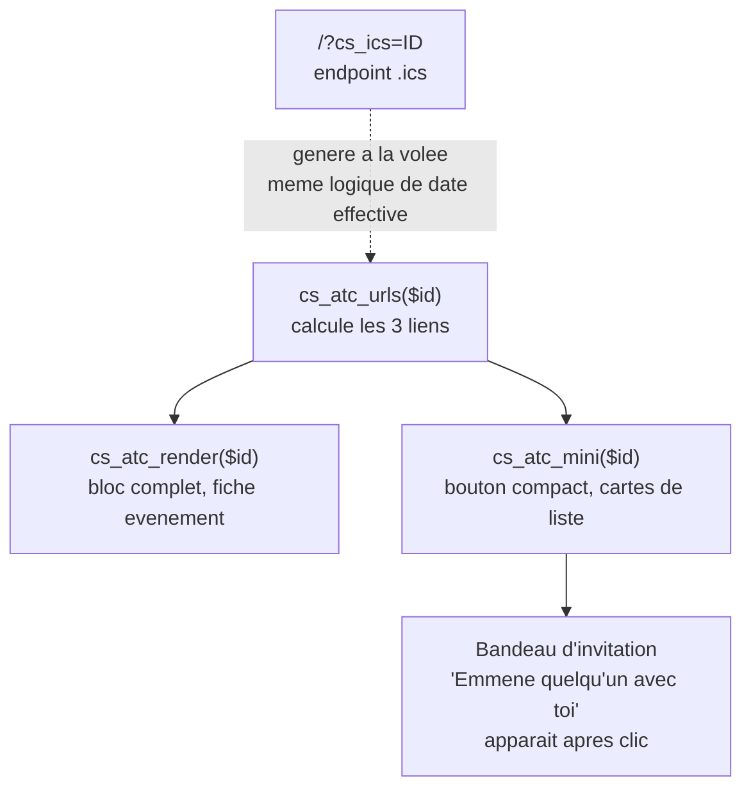

# Agenda Sabauda : « Ajouter à mon agenda »

> Document de référence technique. Décrit la fonctionnalité permettant à un
> visiteur d'ajouter un événement à son agenda personnel (Google, Outlook,
> Apple/iCal), portée entièrement par **le snippet 69** (« CS — Ajouter à mon
> agenda »). Aucun document ne couvrait cette fonctionnalité avant celui-ci.
>
> Dernière mise à jour du code décrit : 2026-07-24.

---

## 0. Vue d'ensemble

Deux points d'entrée visuels, deux usages :

| Composant | Fonction | Où | Usage |
|---|---|---|---|
| **Bloc complet** | `cs_atc_render($id)` | Fiche événement (bas de page) | 3 boutons visibles : Google Agenda, Apple/iCal, Outlook |
| **Bouton compact** | `cs_atc_mini($id)` | Cartes de liste (home, hubs) | Icône « Agenda » + menu déroulant (`<details>`), même 3 liens |

Les deux réutilisent la même fonction centrale `cs_atc_urls($id)`, qui calcule
les 3 URLs (Google / Outlook / .ics) pour un événement donné.



---

## 1. Le problème corrigé le 2026-07-24 : événement déjà en cours

**Avant** : pour un événement long déjà commencé (ex. 1er avril → 31 octobre,
consulté en juillet), cliquer « Ajouter à mon agenda » créait une entrée
d'agenda personnel qui **démarrait au 1er avril** — trois mois dans le passé
pour la personne qui clique aujourd'hui. Deux symptômes :

1. L'entrée créée dans Google/Outlook/Apple semblait déjà terminée.
2. Le texte affiché sur la fiche disait « du 1er avril au 31 octobre »,
   laissant croire à tort que l'événement était fini ou pas commencé (corrigé
   séparément, voir `FICHE_EVENEMENT_AGENDA_SABAUDO.md` §3).

**Correction** : fonction `cs_atc_effective_start($start, $end)`.

```php
function cs_atc_effective_start($start, $end) {
    $now = time();
    return ($now > $start && $now < $end) ? $now : $start;
}
```

Si l'événement est en cours au moment du clic, le point de départ de l'entrée
d'agenda devient **maintenant**, pas la vraie date de début. Appliqué aux 3
canaux : Google (`&dates=`), Outlook (`&startdt=`), et l'endpoint `.ics`
(`DTSTART`).

**Important** : ceci ne change **que** l'entrée créée dans l'agenda personnel
du visiteur. La vraie date de début de l'événement, affichée sur le site
(fiche, cartes), n'est **jamais** modifiée — c'est une distinction
intentionnelle entre « ce qui apparaît sur le site » (toujours la vérité) et
« ce qui est utile dans un agenda personnel » (le point de départ pertinent
pour qui clique aujourd'hui).

---

## 2. Les 3 canaux

### Google Agenda

Lien direct `calendar.google.com/calendar/render?action=TEMPLATE`, ouvert
dans un nouvel onglet. Format de date `Ymd/Ymd` (all-day) ou
`Ymd\THis\Z/Ymd\THis\Z` (horaire précis, UTC).

### Outlook

Lien direct `outlook.live.com/calendar/.../compose`, ouvert dans un nouvel
onglet. Dates au format ISO (`Y-m-d\TH:i:s\Z`).

### Apple / iCal (fichier `.ics`)

**Pas un lien externe** : un endpoint interne au site,
`https://agendasabauda.eu/?cs_ics={ID}`, généré par un handler
`add_action('init', ...)` qui produit un fichier `.ics` (RFC 5545) à la volée
et le sert en téléchargement (`Content-Disposition: attachment`). Fonctionne
pour n'importe quel client compatible iCal (Apple Calendar, Thunderbird, etc.),
pas seulement Apple.

---

## 3. Contenu de l'entrée créée

Commun aux 3 canaux (`cs_atc_title`, `cs_atc_location`, `cs_atc_description`) :

- **Titre** : préfixé `Agenda Sabauda · ` (visible en vue calendrier, pour
  identifier la source du rendez-vous).
- **Lieu** : adresse la plus complète possible (nom du lieu + adresse + ville),
  avec **pays ajouté automatiquement** selon le territoire (« Italie » pour
  Piémont/Vallée d'Aoste, « France » pour Savoie/Nice) — pour que l'itinéraire
  fonctionne correctement dans l'app calendrier.
- **Description** : phrase d'intro signée Agenda Sabauda + résumé de
  l'événement (extrait, 300 caractères max, **jamais** le texte de l'encart
  publicitaire s'il a pollué l'extrait — filtré explicitement) + phrase
  d'invitation + lien vers la fiche complète.
- **Bilingue** : FR ou IT selon `pll_get_post_language($id)`.

---

## 4. Le bouton compact et son bandeau d'invitation (`cs_atc_mini`)

Comportement construit pour maximiser une action sociale (inviter quelqu'un)
sans être intrusif :

1. Clic sur l'icône « Agenda » → menu déroulant (`<details>`/`<summary>`,
   CSS pur, pas de JS pour l'ouverture).
2. Clic sur un des 3 liens (Google/Apple/Outlook) → le menu se ferme, ET
   (si pas déjà montré cette session, via `sessionStorage`) un **bandeau
   d'invitation** apparaît juste sous la carte : « Emmène quelqu'un avec
   toi » + illustration, avec un bouton « Compris » pour le masquer.
3. **Cas particulier géré** : cliquer sur Google Agenda peut, sur certains
   navigateurs mobiles, déclencher une navigation complète (perte de l'état
   JS en mémoire) malgré `target="_blank"`. Le code pose alors un flag dans
   `sessionStorage` (`cs_invite_pending`) **avant** la navigation, et un
   listener `DOMContentLoaded` au retour sur la page réinsère le bandeau au
   bon endroit — sans ce mécanisme, le bandeau disparaissait silencieusement
   au retour sur site (bug réel corrigé en cours de session, cf. rapport
   utilisateur « on a plus le bandeau »).
4. **Un seul bandeau visible à la fois** : `.cs-card-row:has(.cs-atc-mini[open])`
   relève le `z-index` de la carte ouverte au-dessus de ses voisines, pour que
   le bandeau ne soit pas recouvert par l'image de la carte suivante.
5. **Clic extérieur** : un listener global en phase de capture ferme le menu
   ouvert si on clique ailleurs, sans bloquer la navigation si le clic est sur
   un lien d'une **autre** carte.

---

## 5. Compatibilité navigateur intégré Instagram (in-app browser)

`cs_atc_inapp_script()` : Instagram ouvre les liens dans un navigateur intégré
(WebView) qui **bloque les téléchargements et certains liens externes**
(comportement Instagram, pas contournable côté code). Détection via
`navigator.userAgent`.

- **Android** : redirection automatique vers Chrome via un intent Android
  (`intent://...#Intent;scheme=https;package=com.android.chrome;...`).
- **iOS** : Apple interdit la redirection automatique hors d'un WebView tiers
  — impossible à contourner. Un bandeau d'instruction s'affiche à la place :
  « touche les ⋯ en haut, puis "Ouvrir dans le navigateur" ».

---

## 6. Où c'est branché (dépendances)

| Élément | Fichier |
|---|---|
| Toute la logique (`cs_atc_*`, endpoint `.ics`) | Snippet 69 « CS — Ajouter à mon agenda » |
| Appelé depuis | Fiche événement (`cs_atc_render`, voir `FICHE_EVENEMENT_AGENDA_SABAUDO.md` §2 point 14) |
| Appelé depuis | Cartes de liste (`cs_atc_mini`, snippet 21 `cs_card_compact`) |
| Affichage automatique alternatif (désactivé) | `CS_ATC_AUTO` (constante `false` par défaut) — mécanisme `wp_footer` + JS pour insérer le bloc sans dépendre du thème/builder, non utilisé actuellement (bloc inséré explicitement à la place) |

**Anciennes versions** : les snippets **67** et **68** (même nom) sont en
statut `active=-1` (corbeille dans Code Snippets) — des versions de brouillon
antérieures au 69, sans effet sur le site. Pas le même piège que la fiche
événement (§0 de `FICHE_EVENEMENT_AGENDA_SABAUDO.md`), où les deux snippets
concurrents sont bien actifs tous les deux.
