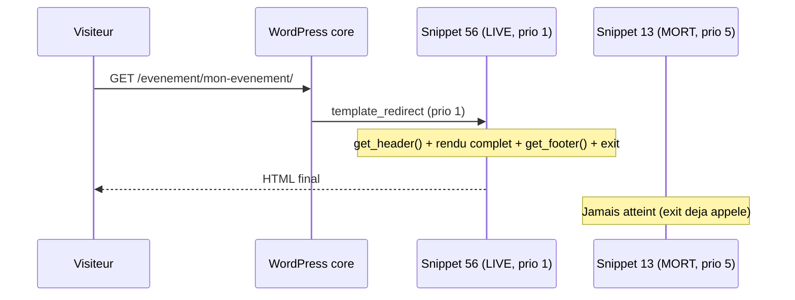

# Agenda Sabauda : la fiche événement (as-built)

> Document de référence technique. Décrit **ce qui est réellement construit et
> live** pour la fiche événement (page single d'un événement), par opposition
> au plan d'intention de `docs/TEMPLATES_WORDPRESS.md` (§B.7), qui date du
> 2026-07-06 et n'est plus exact sur ce point (voir §0 ci-dessous).
>
> Dernière mise à jour du code décrit : 2026-07-25.

---

## 0. ⚠️ Piège trouvé et corrigé : un snippet mort était actif

Il existait **deux implémentations concurrentes** de la fiche événement dans
Code Snippets, toutes les deux actives, sur le même hook :

| Snippet | Nom | Priorité `template_redirect` | Statut |
|---|---|---|---|
| **56** | CS · Gabarit Fiche Événement (tribe_events) | **1** | **LIVE** — celui qui s'affiche |
| 13 | CS · Fiche événement (meta) | 5 | **Désactivé le 2026-07-24** (était mort de toute façon) |

Les deux faisaient `get_header()` + rendu + `get_footer()` + `exit` sur
`is_singular('tribe_events')`. Comme WordPress exécute les callbacks de même
hook dans l'ordre de priorité croissante, le snippet 56 (priorité 1)
s'exécutait et sortait (`exit`) **avant** que le snippet 13 (priorité 5) ait
la moindre chance de s'exécuter. Le code du snippet 13 était donc
**totalement inerte**, bien que marqué actif — un piège pour quiconque
(humain ou IA) lit le snippet 13 en le prenant pour la vérité live (**ça a
concrètement fait écrire une erreur dans la première version de ce document,
voir §4**).

**Conséquence** : le snippet 13 documentait/prévoyait **3 rails** (Au même
endroit → Même catégorie → Près d'ici, mêmes dates) et un système de badges
de statut (« Complet », « Dernier jour »…). Depuis le 2026-07-24, le snippet
56 a reconstruit les 3 rails et 2 des 3 badges (Dernier jour / En cours,
« Complet » exclu par choix) — voir §4 et §5.

**Action effectuée (2026-07-24)** : snippet 13 **désactivé** (pas supprimé,
réversible). Vérifié après coup : la fiche événement continue de fonctionner
normalement (statut 200, contenu inchangé) — confirme qu'il était bien
totalement mort. Ce document ne décrit que le snippet 56.

---

## 1. Où et comment c'est rendu

- **Snippet 56**, hook `template_redirect` priorité 1, condition
  `is_singular('tribe_events')`.
- Même méthode que la home (§1 de `REGLES_HOMEPAGES_AGENDA_SABAUDA.md`) :
  `get_header()` + rendu manuel + `get_footer()` + `exit`, donc **hors de La
  Boucle WordPress** — mêmes précautions (`in_the_loop()` toujours faux ici).
- Traduction FR/IT **intégrée directement dans le snippet** (pas de traduction
  automatique façon page 928→1717) : un tableau `$LB` de libellés + une
  fonction `$tr()`, activés si `pll_get_post_language($event_id) === 'it'`.



---

## 2. Structure de la page (ordre réel d'affichage)

1. Fil d'Ariane (Accueil > Catégorie > Ville)
2. `<h1>` titre
3. Barre d'ancres « Dans cette fiche » (Quand / Où & prix / Carte) — seulement
   les ancres pertinentes (affichées seulement si la donnée existe)
4. Image mise en avant (3:2) + crédit photo, **ou image de repli** si absente
   (voir `REGLES_HOMEPAGES_AGENDA_SABAUDA.md` §7 — même mécanisme, snippet 87)
5. Description (contenu natif TEC, `post_content`)
6. Section **Quand** (`#as-quand`) : date(s), horaire
7. Section **Où & prix** (`#as-ou`) : lieu, adresse, prix, billetterie, source
   officielle, catégorie, « Vérifié le »
8. Section **Carte** (`#as-carte`) : Google Maps embarqué (via Complianz,
   consentement cookie) + lien « Ouvrir dans Maps »
9. Rail **« Au même endroit »** (voir §5)
10. Rail **« Même catégorie »** (voir §5)
11. Bouton Instagram (territoire de l'événement, voir §6)
12. Bouton Facebook (**masqué depuis le 2026-07-26**, aucun compte n'existe — voir §6)
13. Formulaire de recherche
14. Bloc « Ajouter à mon agenda » (voir `AJOUTER_AU_CALENDRIER_AGENDA_SABAUDA.md`)
15. Bandeau newsletter (texte adapté à la ville de l'événement si connue)

---

## 3. Section « Quand » : logique événement en cours

Corrigé le 2026-07-24 (demande explicite, voir aussi §8 du doc homepages) :

```php
$as_in_progress = ($as_s_day < $as_today && $as_e_day >= $as_today);
```

- Si l'événement est **en cours** (a commencé, pas encore fini) : affiche
  « Jusqu'au {fin} » (FR) / « Fino al {fin} » (IT).
- Sinon : affiche « Date : {début}[ - {fin}] » (format classique), comme avant.

Corrige le cas d'un événement long (ex. avril → octobre) consulté en cours de
route, qui affichait auparavant « Date : 01/04/2026 - 31/10/2026 » — trompeur
(laisse croire que c'est fini ou pas commencé).

---

## 4. Badges de statut : construits le 2026-07-24 (Dernier jour / En cours uniquement)

**Historique** : `cs_event_badges()` (« Complet », « Dernier jour », « En
cours »…) était définie dans le snippet 13 (mort, voir §0) mais jamais
appelée par le snippet 56 — la fiche événement n'affichait alors aucun badge.

**Décision (2026-07-24, revue critique demandée par Franck)** : reconstruire
uniquement 2 des 3 badges prévus, directement dans le snippet 56, à partir des
dates déjà en base (`$start`/`$end`), **sans reprendre `as_statut`** :

- « Dernier jour » (FR) / « Ultimo giorno » (IT) : événement en cours, fin
  aujourd'hui.
- « En cours » (FR) / « In corso » (IT) : événement en cours, fin plus tard.
- **« Complet » explicitement exclu.** Justification : `as_statut` est une
  meta éditoriale à mettre à jour manuellement, jugée peu fiable sur un site
  largement alimenté par import automatique (RSS) — afficher « Complet » à
  tort serait pire que ne rien afficher. Les 2 badges retenus sont du pur
  calcul de date, zéro dépendance éditoriale, zéro risque d'être faux.

Rendu en pastille rouge (`background:#DC5D45`) directement sous le `<h1>`.
Vérifié en direct sur l'événement « Visite au château de Montrottier »
(en cours depuis longtemps) : badge « En cours » affiché.

---

## 5. Les rails contextuels

Remplacent un ancien bloc générique « En vedette », jugé trop imposant et sans
rapport avec ce que l'utilisateur regarde (retour Franck, 2026-07-20).

| Rail | Critère | Exclusions |
|---|---|---|
| **Au même endroit** | même `_EventVenueID`, à venir (`_EventStartDate` ≥ maintenant), 6 max | l'événement courant |
| **Même catégorie** | même terme `tribe_events_cat` principal, à venir, 6 max | l'événement courant + tout ce qui est déjà dans « Au même endroit » |
| **Près d'ici, mêmes dates** (construit le 2026-07-24) | `_EventStartDate` entre le début de l'événement courant et +3 jours | l'événement courant + les 2 rails précédents |

Un rail **ne s'affiche pas du tout** si sa requête ne retourne aucun résultat
(`$render_rail` retourne silencieusement si `!$query->have_posts()`) — pas de
« No data was found » ici, contrairement aux sections home (§5.2 du doc
homepages). Différence de comportement assumée : ces rails sont secondaires,
une section vide n'est pas un signal utile ici.

Le 3e rail « Près d'ici, mêmes dates » (prévu par le snippet 13, mort) est
**construit et live depuis le 2026-07-24**, directement dans le snippet 56 —
voir tableau ci-dessus. Vérifié en direct sur l'événement IT 2327 (« Gilles
Peterson presents... »), 14 voisins bruts trouvés dans la fenêtre.

---

## 6. Réseaux sociaux : Instagram corrigé, Facebook toujours mort

- **Instagram** : corrigé le 2026-07-24. Réutilise `cs_instagram_account()`
  (snippet 88, voir doc homepages §9), mais avec le territoire de **cet
  événement précis** (via sa taxonomie `territoire`), pas le cookie/GET
  site-wide — nouvelle fonction `cs_instagram_canon_for_event($event_id)`
  (snippet 88). Le libellé du bouton précise le compte suivi (« Suivre Agenda
  Sabauda Savoie sur Instagram »). **Le bouton n'apparaît que si l'événement
  est en Savoie ET la fiche en français** (même règle que la home, §9 doc
  homepages) : pour un événement d'un autre territoire, ou une fiche en IT,
  `cs_instagram_account()` renvoie `null` et le bloc `<a>` Instagram est
  **entièrement masqué** (pas de repli vers Savoie).
- **Facebook** : **masqué depuis le 2026-07-26.** Le bouton était un lien mort
  (`href="#"`) : aucun compte Facebook n'existe pour aucun territoire. Rendu
  conditionnel via `$cs_fb_acc = null` (même logique que l'Instagram voisin) :
  le `<a>` n'est plus jamais affiché. Réactivation triviale le jour où un compte
  existera (renseigner `$cs_fb_acc` avec une clé `url`). Ancien code sauvegardé
  dans l'option `cs_snippet56_backup_fb_*`.

---

## 7. Traduction FR/IT

Contrairement à la home (traduction automatique 928→1717 via dictionnaire
`str_replace`, voir doc homepages §2), la fiche événement est **bilingue par
construction** : chaque événement est un post WordPress distinct par langue
(Polylang), et le même snippet 56 s'exécute pour les deux, en changeant
simplement de libellés via `$tr()`. Il n'y a donc **pas de page "source
unique"** ici — chaque traduction d'événement est éditée séparément dans TEC/
Polylang, comme n'importe quel autre custom post type traduit.

---

## 8. Dépendances

- `cs_fallback_visual()`, `cs_event_venue_line()`, `cs_event_territory_pill()`,
  `cs_pill_class()` — snippet 21 (« CS · Composants carte (partagé) »).
- `cs_atc_render()` — snippet 69, voir `AJOUTER_AU_CALENDRIER_AGENDA_SABAUDA.md`.
- `cs_instagram_account()`, `cs_instagram_canon_for_event()`,
  `cs_terr_canon_data()` (via mu-plugin `cs-territoire-persistant.php`) —
  snippet 88.
- `cs_event_badges()` — n'existe plus (snippet 13 désactivé le 2026-07-24) et
  n'était de toute façon jamais appelée par le snippet 56 — voir §0/§4.

---

## 9. Écarts connus avec le plan d'origine (`TEMPLATES_WORDPRESS.md` §B.7)

| Prévu (2026-07-06) | Réalité (2026-07-25) |
|---|---|
| 3 rails (même lieu / catégorie / dates) | **Les 3 rails sont live** depuis le 2026-07-24 |
| Badges d'état (§8.3 du brief) | **Dernier jour / En cours live** depuis le 2026-07-24 ; « Complet » exclu par choix explicite (voir §4) |
| — | Ancres de navigation « Dans cette fiche » (Quand / Où & prix / Carte), non prévues dans le plan |
