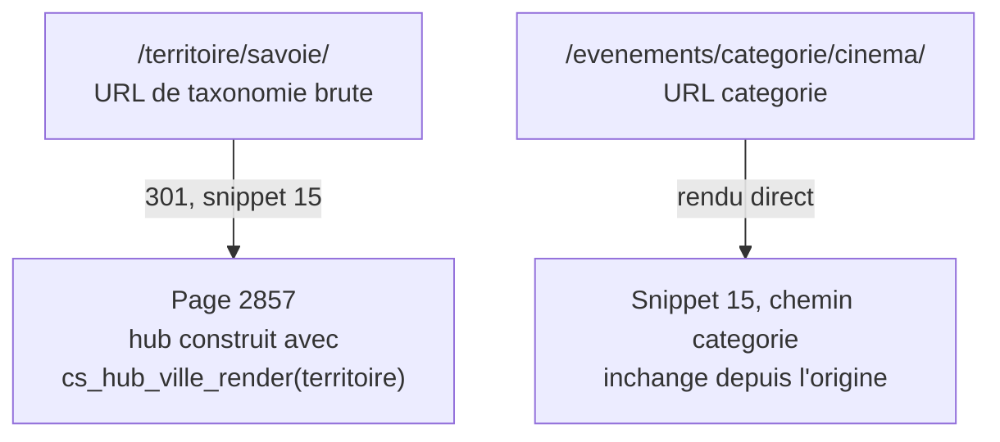

# Agenda Sabauda : les hubs territoire et ville (as-built)

> Document de référence technique. Décrit ce qui est réellement construit et
> live pour les pages hub — territoire, ville, et leurs déclinaisons datées
> (aujourd'hui/ce week-end/cette semaine). Complète (sans le remplacer)
> `docs/TEMPLATES_WORDPRESS.md` §A.4 et §C.11 (plan d'intention).
>
> Dernière mise à jour du code décrit : 2026-07-24.

---

## 0. Deux systèmes, un seul vraiment utilisé pour les territoires

Comme pour la fiche événement (`FICHE_EVENEMENT_AGENDA_SABAUDA.md` §0), il y a
ici une bascule d'un ancien système vers un nouveau — mais gérée proprement
cette fois, **par redirection explicite**, pas par un doublon de snippet
silencieux :

- **Snippet 15** (« CS · Gabarit Hub territoire/catégorie ») gérait à l'origine
  les pages de taxonomie `territoire` **et** `tribe_events_cat`
  (`template_redirect` sur `is_tax(...)`).
- **2026-07-23** : pour la taxonomie `territoire` uniquement, ce gabarit a été
  jugé cassé (filtres qui ne fonctionnaient plus) et remplacé par le nouveau
  moteur « hub ville » (snippet 61) utilisé **en mode territoire**. Un bloc de
  redirection 301 a été ajouté **en tête du snippet 15 lui-même** :

  ```php
  $cs_terr_hub_redirect_map = array(
      3 => 2857, 318 => 2858,   // Savoie FR -> page 2857, Savoia IT -> 2858
      6 => 2859, 321 => 2860,   // Piémont FR -> 2859, Piemonte IT -> 2860
      8 => 2861, 324 => 2862,   // Vallée d'Aoste FR -> 2861, IT -> 2862
      10 => 2863, 327 => 2864,  // Comté de Nice FR -> 2863, IT -> 2864
  );
  ```

  Toute visite de `/territoire/savoie/` (URL de taxonomie brute) redirige donc
  en 301 vers la page 2857 (le hub construit avec `cs_hub_ville_render` en mode
  territoire). **`tribe_events_cat` n'est pas concerné** : les pages catégorie
  continuent de passer normalement par le reste du snippet 15, inchangé.

- **Résultat** : le snippet 15 reste actif et utile (hub catégorie + la
  redirection elle-même), il n'y a **pas** de code mort ici, juste une
  redirection en cascade. Voir aussi `cs-redirections-301.php` (slugs de
  taxonomie) et `cs-redirect-weekend-legacy.php` (§11bis du doc homepages) —
  **3 mécanismes de redirection différents** existent sur le site pour des
  raisons historiques différentes ; celui-ci est le 3e, propre aux 4 pages
  taxonomie territoire.



---

## 1. Le moteur central : `cs_hub_ville_render()` (snippet 61)

Un **shortcode unique**, `[cs_hub_ville]`, utilisé dans le `post_content` de
chaque page hub (territoire, ville, et leurs déclinaisons datées), avec des
attributs qui changent son comportement :

| Attribut | Usage |
|---|---|
| `villes="Chambéry,Aix-les-Bains"` | Mode **ville** : filtre sur `_VenueCity` (comparaison `LIKE`, plusieurs villes possibles) |
| `territoire="savoie"` | Mode **territoire** : filtre sur la taxonomie (via `cs_terr_canon_data()`) — utilisé si `villes` est vide |
| `quand="weekend"` | Fenêtre de date par défaut (voir §2) si aucun `?quand=` dans l'URL |
| `limite="50"` | Nombre max d'événements affichés (défaut 50) |
| `prep_fr="à"` / `prep_it="a"` | Préposition pour les titres/FAQ générés (« Que faire **à** Chambéry » vs « Que faire **en** Savoie ») |
| `ville_label="..."` | Libellé affiché si différent du nom de ville/territoire brut |

Une seule et même fonction gère donc les 4 hubs territoire, toutes les pages
ville, **et** leurs sous-pages datées — c'est le sens du « gabarit
réutilisable » du nom du snippet.

---

## 2. Fenêtres de date (`cs_hub_window()`)

Trois valeurs possibles pour `quand` (paramètre d'URL `?quand=` ou attribut du
shortcode) :

| Valeur | Fenêtre |
|---|---|
| `aujourdhui` | Aujourd'hui 00:00 → aujourd'hui 23:59 |
| `semaine` | Aujourd'hui 00:00 → J+6 23:59 (7 jours) |
| `weekend` | Vendredi 00:00 → dimanche 23:59 de la semaine courante (calcul explicite du jour de la semaine, `current_time('N')`) |

Ces 3 valeurs correspondent aux 3 sous-pages datées que possède chaque hub
(ex. pour Savoie : `/que-faire-en-savoie/aujourdhui/`, `/ce-week-end/`,
`/cette-semaine/`) — chaque sous-page est une vraie page WordPress enfant,
avec sa propre meta `cs_hub_quand` (voir §4), pas juste un filtre d'URL.

---

## 3. Filtres visiteur (au-dessus des filtres shortcode/fenêtre)

En plus de la fenêtre de date fixée par la page, un visiteur peut affiner via
un formulaire GET :

- `?jour=YYYY-MM-DD` — un jour précis (prioritaire sur `quand`)
- `?ville=NomVille` — restreint à une ville (liste déduite dynamiquement des
  événements du hub, pas une liste fixe)
- `?categorie=slug` — restreint à une catégorie (liste déduite de la même
  façon)

Les options des menus déroulants (villes, catégories disponibles) sont
calculées **à partir du jeu de résultats de base** (avant filtre visiteur),
pas d'une liste globale — un visiteur ne voit donc jamais un filtre qui
mènerait à 0 résultat.

---

## 4. Les sous-pages datées : héritage depuis le parent

Chaque sous-page datée (`cs_hub_quand` = `aujourdhui`/`weekend`/`semaine`) est
une page WordPress **enfant** du hub territoire/ville, et hérite de lui :

- **Le shortcode `[cs_hub_ville ...]`** : si la sous-page ne le contient pas
  elle-même, le rendu prend celui du **parent** (`$cs_parent_hub`).
- **L'image** (`cs_hub_image`) : idem, héritée du parent si absente.
- **Le texte « À propos »** (contenu sous le shortcode dans le hub principal) :
  hérité du parent si la sous-page n'en a pas.

**Titre/description SEO dynamiques pour le week-end** (`cs_dated_weekend_data()`) :
la page « Ce week-end en X » calcule un `<title>`/meta description qui
**inclut le nombre réel d'événements trouvés** pour ce week-end précis (« Le
programme de ce week-end à Chambéry : 12 événements à découvrir, du 25/07 au
27/07 »), régénéré à chaque requête — pas un texte statique. Bascule vers un
message adapté si `n === 0` (« Aucun événement encore annoncé… »). Ce texte
écrase le `<title>`/meta Yoast (`wpseo_title`/`wpseo_metadesc`) uniquement sur
les pages où `cs_hub_quand === 'weekend'`.

---

## 5. FAQ automatique (SEO + AEO)

Toute page marquée `cs_hub_quand` (datée) ou `cs_hub_ville` (hub) affiche une
section FAQ en bas de page, avec balisage `schema.org/FAQPage` (JSON-LD) —
levier explicite pour l'indexation par les moteurs de recherche IA (AEO).

**Construction hybride** (`cs_hub_faq_build()`) :
1. **Socle commun** : 4 questions génériques toujours présentes, adaptées à la
   ville/préposition (« Que faire à {ville} quand il pleut ? », « … 
   gratuitement ? », « … en famille ? », « Où sortir le soir ? »), chaque
   réponse pointant vers les hubs catégorie pertinents.
2. **Surcouche par hub** : meta `cs_hub_faq` du hub (une question par ligne,
   format texte `Question | Réponse`), ajoutée après le socle. Permet
   d'ajouter des questions spécifiques à une ville sans toucher au code.

---

## 6. Repli « Aux alentours » (contenu pauvre)

Si le résultat filtré d'un hub territoire (`count($q) <= 3`) est pauvre, une
section « Aux alentours » propose jusqu'à 6 événements du **même territoire**,
en excluant les lieux déjà couverts par le hub ville courant
(`_EventVenueID NOT IN`). Ne s'affiche que pour les hubs en `territoire=`,
pas ceux en `villes=`.

**Différence avec le repli du hub catégorie** (snippet 15, §7) : celui-ci
reste **dans le même territoire**, alors que le repli catégorie va chercher
**dans les autres territoires** — logiques symétriques mais pas identiques,
à ne pas confondre.

---

## 7. Hub catégorie (reste du snippet 15, chemin non redirigé)

Pour une page `tribe_events_cat` (catégorie), rendu direct (pas de
redirection) :

- **Repli inter-territoires** : si le résultat filtré par le territoire actif
  (cookie/GET) est pauvre (`found_posts <= 3`), section « Ailleurs dans
  l'espace alpin » proposant la même catégorie dans les **3 autres**
  territoires (symétrique au §6, mais côté catégorie).
- **Message vide contextualisé** : au lieu d'un « Aucun résultat » plat,
  message qui nomme la catégorie **et** le territoire actif (« Pas encore
  d'événement « Cinéma » programmé en Piémont »).
- **`<title>`** : TEC réécrit par défaut le titre en « Événements depuis DATE…
  Nom » — un filtre `document_title_parts` (priorité 20, après TEC) rétablit
  le nom du terme seul.
- **Intro éditoriale** : si le terme WordPress a une **description** remplie
  (`$term->description`), elle s'affiche telle quelle (texte évergreen,
  éditable sans toucher au code) ; sinon texte générique de repli.

---

## 8. Dépendances

- `cs_terr_canon_data()`, `cs_territoire_actif()` — mu-plugin
  `cs-territoire-persistant.php`.
- `cs_render_day_groups()`, `cs_card_compact()`, `cs_card_standard()` —
  snippet 21.
- Metas custom utilisées : `cs_hub_ville`, `cs_hub_quand`, `cs_hub_territoire`,
  `cs_hub_h1`, `cs_hub_h2`, `cs_hub_image`, `cs_hub_faq`, `cs_guide_territoire`,
  `cs_guide_cat_term` (liaison avec les articles « Le Fil », section « À
  lire »).

---

## 9. Écarts / points d'attention

- Le mode `territoire=` ET le mode `villes=` du shortcode partagent la même
  fonction mais ont des comportements de repli différents (§6 vs §7) — facile
  à confondre si on lit le code vite.
- La redirection 301 territoire (§0) vit **dans le snippet 15**, pas dans un
  mu-plugin de redirection dédié — un lecteur cherchant « où sont gérées les
  redirections du site » pourrait la manquer s'il ne regarde que les 2 autres
  mécanismes déjà documentés.
