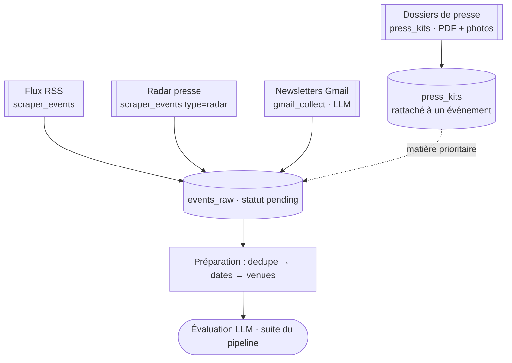
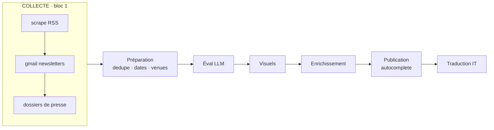
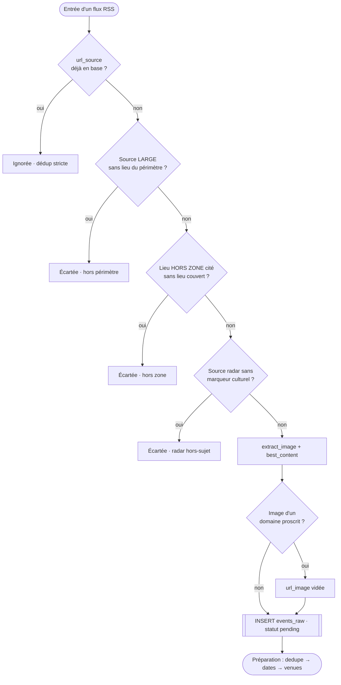

# La collecte — comment les événements entrent dans le pipeline

*État des lieux du pipeline de collecte de Cultura Sabauda / Agenda Sabauda (26 juillet 2026). Décrit le système RÉEL (tel qu'il est codé) : d'où viennent les événements, comment ils sont récupérés, normalisés, dédupliqués à l'insertion et stockés dans `events_raw`, et quels garde-fous filtrent le bruit. Document de travail — à relire et amender.*

---

## 1. Le principe

La collecte est le **premier maillon** de la chaîne « **collecte → éval → visuels → enrichissement → publication → traduction** ». Son seul rôle : **faire entrer de la matière brute** dans la table `events_raw` avec le statut `pending`, sans jamais rien publier ni juger de la qualité (c'est l'évaluateur, plus loin, qui note).

Quatre **canaux** alimentent la même table, par ordre d'importance de matière :

| Canal | Script | LLM ? | Ce qu'il apporte |
|---|---|---|---|
| **Flux RSS** | `scripts/scraper_events.py` | non | le gros du volume : institutions, lieux, offices de tourisme qui exposent un flux |
| **Radar presse** ⛔ **DÉSACTIVÉ 2026-08-05** | `scripts/scraper_events.py` (type `radar`) | non | **détection seule** de signaux via la presse / Google News — jamais crédité ni lié |
| **Newsletters Gmail** | `scripts/gmail_collect.py` | **oui** (extraction) | les programmations publiées **uniquement par email** (théâtres, musées, offices) |
| **Dossiers de presse** | `scripts/press_kits.py` | non | la **meilleure matière** : PDF, photos avec droits, info avant le public |

Deux principes traversent toute la collecte :

- **Déterministe par défaut** : seul le canal newsletter appelle un LLM (un mail = texte libre à découper en N événements). RSS, radar, dossiers de presse et toute la préparation (dates, lieu, dédup) sont **100 % code** (`docs/LLM_OU_CODE.md`).
- **Idempotence + non-blocage** : chaque étape ne retraite que le nouveau (dédup stricte) et un échec isolé (flux mort, panne API) n'arrête pas la chaîne.



---

## 2. Le canal RSS (`scripts/scraper_events.py`)

### Les sources et leur format

Les flux sont déclarés une ligne par source dans `config/sources.txt`, chargés par `load_sources()` :

```
url;territoire;nom;tier[;lieu;ville]
```

- **territoire** : `Savoie` | `Piemonte` | `Vallee-Aoste` | `Nice` (les quatre versants de l'espace sabaudo) ;
- **tier** (stocké tel quel dans `source_type`) : `officielle` (organisateur/lieu primaire), `institution` (collectivité), `tourisme` (office de tourisme), `radar` (presse/Google News). Ce libellé pilote plus tard la **priorité de fusion** au dédup (`dedupe.TIER_RANK`) ;
- **lieu / ville** (optionnels) : pour une source « officielle » mono-lieu (un théâtre, un musée), le lieu **est** la source → il est appliqué par défaut (repris par `scripts/venues.py`, passe 0).

Le split est sûr car les URL n'utilisent jamais `;` (query en `&`). Les lignes vides ou commençant par `#` sont ignorées.

### Récupération d'un flux

`scrape_source()` parse le flux avec `feedparser` (échec = log + `return 0`, on continue), puis pour chaque entrée :

1. **`extract_image(entry)`** — cherche une image dans l'ordre des champs RSS standards : `media:content`, `enclosures` de type image, `media:thumbnail`, puis en dernier recours la **première ``** du résumé / `content` HTML.
2. **`best_content(entry)`** — retient le texte le plus complet (`content:encoded` prioritaire sur `summary`), puis `strip_boilerplate()` (`utils/clean_text`) retire les artefacts de scraping (spacers Elementor, pieds « appeared first on / proviene da », boutons). Tronqué à 10 000 caractères.

L'événement retenu est inséré dans `events_raw` : `title`, `description` (= `best_content`), `date_start` (= `entry.published`, la date de **publication** du flux, pas celle de l'événement — voir §7), `territoire`, `url_source`, `url_image`, `source_name`, `organisateur` (= `entry.author`), `source_type`.

---

## 3. Le canal newsletters Gmail (`scripts/gmail_collect.py`)

Beaucoup d'institutions ne publient leur programmation **que par newsletter**. Le canal fonctionne par **curation humaine + extraction LLM** :

1. Franck s'abonne aux newsletters et applique le **label Gmail « Agenda »** (via Claude-in-Chrome). Le label est le **sélecteur primaire** ; `config/newsletters.txt` n'est qu'un registre de suivi, il ne déclenche aucune collecte.
2. Le script lit les mails portant ce label sur une fenêtre glissante (`GMAIL_LOOKBACK_DAYS`, défaut 7 j), en **OAuth2 read-only** (`utils/google_auth`). Setup une fois sur le VPS : `--setup`.
3. `parse_message()` reconstruit le corps texte. Il **préfère le HTML** (via `_linkify_html`, qui transforme `<a href>` en « texte (URL) » pour que les liens d'articles survivent au strip) et retombe sur le `text/plain`. Corps tronqué à 6 000 caractères.
4. `extract_events()` envoie le mail au modèle (`ANTHROPIC_MODEL_EXTRACT`, défaut Sonnet) avec `EXTRACT_PROMPT` : le LLM renvoie un **tableau JSON** d'événements distincts (titre, date, lieu, ville, description réécrite, URL), ou `[]` (édito, actu générale). Un mail = **N événements**.
5. `insert_events()` insère chaque événement (`statut='pending'`). Le **territoire** est deviné depuis l'expéditeur via `config/whitelist_gmail.txt` (`match_territory` : sous-chaîne du `From` → territoire ; vide si inconnu).

**Choix notable — pas d'image depuis l'email** : `parse_message` ne récupère **jamais** d'image (`url_image=""`). Constaté en production : la 1re `` d'une newsletter est quasi toujours l'en-tête/logo du template de l'expéditeur, collé à tort sur 40 événements sans rapport. On laisse la chaîne visuels (`scripts/visuals`) résoudre une image fiable depuis la vraie page de l'événement.

**Robustesse API** : une panne d'appel (`API_ERROR`) **arrête proprement** la boucle sans marquer le mail traité → il sera repris au prochain run.

---

## 4. Le canal dossiers de presse (`scripts/press_kits.py`)

En tant que média, Cultura Sabauda obtient des organisateurs, gratuitement et sans risque juridique, ce qu'aucun scraping ne donne : **dossier de presse PDF, photos avec droits, info avant le public** (CHARTE §5, §8). C'est le **jumeau du canal newsletter**, réutilisant toute la plomberie Gmail (`build_service`, `parse_message`, `match_territory`) — une seule source de vérité.

1. Franck applique le label Gmail **« Presse »** aux mails d'accréditation / dossiers.
2. Le script lit ces mails (fenêtre `GMAIL_PRESSE_LOOKBACK_DAYS`, défaut 30 j).
3. `process_attachments()` extrait le **texte des PDF** (`pypdf`, dégrade proprement si absent) et enregistre les **photos** sur disque (`data/press_kits/<message_id>/`).
4. Le tout est stocké dans la table **`press_kits`** (distincte de `events_raw`) : corps, texte PDF, nombre de photos, dossier, territoire.
5. `match_event()` tente de **rattacher** le dossier à un événement déjà en base : `kit_matches()` (≥ 2 mots significatifs communs entre sujet et titre, hors noms de lieux) sur le même territoire. `rematch_unmatched()` retente les orphelins à chaque run (l'événement a pu être scrapé **après** l'arrivée du dossier).

L'agent d'enrichissement (`scripts/enrich.py`) puise ensuite dans `press_kits` comme **matière prioritaire** (source primaire, pas de la presse concurrente). **Aucun LLM ici** : collecte + extraction + rattachement sont déterministes. Déclenché à la main aujourd'hui (peut passer en cron).

---

## 5. Le radar presse (dimension transverse du RSS)

⛔ **DÉSACTIVÉ le 2026-08-05** (Franck : « trop de bruit, on garde les sources
officielles »). Les 14 flux radar de `config/sources.txt` sont commentés — plus
aucune collecte. Le mécanisme décrit ci-dessous reste en place dans le code (il
protège le stock déjà en base) mais ne s'alimente plus. `scripts/purge_radar.py`
écoule le stock : 146 fiches non résolues rejetées le jour même, 12 déjà en ligne
laissées à une décision explicite (voir `scripts/audit_radar_published.py`).
Réactiver : décommenter les lignes dans `config/sources.txt`.

Le **radar** n'est pas un canal séparé : c'est un `source_type = radar` dans `config/sources.txt` (presse généraliste, Google News). Sa règle est stricte : **détection seule, jamais crédité ni lié** dans les productions (pas de pub aux journaux concurrents ; `utils/sources.py` gère la liste `config/press_domains.txt` et `is_press()`). L'info est attribuée à l'acteur primaire.

Comme la presse ramène surtout du bruit (sport, faits divers, météo), un **filtre POSITIF** s'applique à l'insertion (étage 3 de `scrape_source`) : une entrée radar n'est gardée que si son texte matche un **marqueur culturel/touristique** de `config/radar_cultural_exceptions.txt` (`is_radar_relevant`). Choix de conception assumé : un filtre positif (« garde si signal culturel ») est plus robuste qu'une liste négative de mots hors-sujet à énumérer — le vocabulaire du fait-divers est trop varié (« chute », « percute », « noyade »… jamais exhaustif), alors qu'un vrai événement porte quasi toujours un mot du champ lexical (festival, concert, musée, patrimoine…). Constaté sur un lot réel de 31 articles Le Dauphiné.

Le même filtre est réappliqué **rétroactivement** au stock déjà en base par `clean_radar_offtopic()` (scopé aux seules sources radar `pending`, idempotent) — rattrape un radar resserré après coup. `config/radar_offtopic_keywords.txt` conserve l'ancienne approche négative, désormais secondaire.

---

## 6. Les garde-fous à l'insertion

Trois défenses **déterministes et gratuites** filtrent chaque entrée, dans `scrape_source()`, avant l'`INSERT` :

| Garde-fou | Fonction | Rôle |
|---|---|---|
| **Source LARGE** | `is_broad_source` + `mentions_perimeter` | une source dont la couverture **déborde** le périmètre (ex. `news.google.com`, listée dans `config/broad_sources.txt`) n'est gardée que si le texte **cite un lieu du périmètre** (`config/perimeter_keywords.txt`). |
| **Hors zone** | `is_out_of_scope` | **toute** source : écartée si le texte cite un lieu clairement **hors zone** (`config/out_of_zone.txt` : Lyon, Avignon, Milano…) **sans aucun lieu couvert**. Détection positive, indépendante du domaine → rattrape le radar mal rangé (ex. « Festival d'Avignon » classé Savoie). |
| **Radar hors-sujet** | `is_radar_relevant` | source `radar` uniquement : gardée seulement si marqueur culturel présent (§5). |
| **Image proscrite** | `is_blocked_image` | une image servie par un CDN de presse / agrégateur (`config/blocked_image_domains.txt`) est **vidée** (`url_image=""`) → on retombera sur la bannière. Ceinture de sécurité contre la vignette tierce sans rapport. |

Les deux premiers tournent **aussi en rétro-nettoyage** sur le stock `pending` via `clean_out_of_perimeter()` (motif A : source large sans lieu couvert ; motif B : lieu hors zone cité sans lieu couvert) — idempotent, l'événement passe alors `statut='rejected'` avec la justification.

Un doute lève le rejet : un lieu couvert cité **même en passant** (tournée, comparaison) laisse la décision au LLM plus loin (`is_out_of_scope` exige hors-zone **ET** aucun couvert).

### Le cooldown des recherches web

Ce garde-fou-là ne concerne pas l'insertion mais protège le **coût** de la complétion web en aval (lieu/date/image, §7). `scraper_events.py` en héberge la mécanique commune : `web_cooldown_sql` / `web_cooldown_ok` / `mark_web_attempt`, avec `WEB_COOLDOWN_DAYS` (défaut **7 j**). Une recherche web qui a échoué ne réussira pas si on la relance tout de suite → on **horodate** la tentative (`venue_web_at`, `date_web_at`, `image_web_at`) et on ne ré-essaie qu'après le cooldown. Évite de re-payer chaque jour les cas introuvables et fait tourner l'agent sur d'**autres** événements.

---

## 7. Normalisation (dates, lieu, territoire)

La normalisation est **répartie** : le territoire est fixé à la collecte, les dates et le lieu sont enrichis par des scripts dédiés juste après (étape « préparation » du cron), car l'info ne vit souvent que dans la prose de la page cible.

- **Territoire** — posé à l'insertion depuis la config de la source (RSS) ou deviné de l'expéditeur (Gmail via `whitelist_gmail.txt`). Valeurs canoniques `Savoie | Piemonte | Vallee-Aoste | Nice` ; `utils/sources._canon_territory` absorbe ensuite les variantes (« Haute-Savoie », « Piémont », « Valle d'Aosta », « Nizza »…).
- **Dates** (`scripts/dates.py`) — le RSS ne donne que la date de **publication** (`date_start`). La vraie période est extraite en trois passes, du plus sûr au dernier recours : (1) regex FR/IT sur titre+description (« du 5 au 8 juillet », « dal 30 giugno al 3 luglio »…), (2) JSON-LD schema.org `Event` + `<time datetime>` de la page, (3) LLM sur la prose (désactivable `DATES_LLM=0`). Sortie : `date_event_start` / `date_event_end` (ISO) + `date_source`. Sert à circonscrire le travail à une période.
- **Lieu** (`scripts/venues.py`) — le scraper ne remplit pas `lieu`/`ville` (l'adresse est dans la prose). Extraction : (1) JSON-LD `location` (name + addressLocality), (2) LLM (désactivable `VENUES_LLM=0`). Sortie : `lieu` / `ville` + `venue_source`. Une source « officielle » mono-lieu applique son lieu par défaut (passe 0).
- **URL** — `utils/sources.strip_tracking` retire les paramètres de traçage (`utm_*`, `fbclid`, `mc_*`…) tout en gardant les paramètres utiles (id d'article, page).

---

## 8. Déduplication à l'insertion

La collecte se protège des doublons à **trois niveaux**, avant même le dédup métier (`scripts/dedupe.py`, étape suivante du pipeline) :

- **`url_source` UNIQUE** (contrainte de table) : `scrape_source` teste l'existence avant insert, et un `INSERT OR IGNORE` / `except sqlite3.IntegrityError` absorbe les races. Gmail et press_kits fabriquent une URL de repli quand le mail n'en donne pas (`gmail:{message_id}#{idx}`, `translated:…`) pour rester unique.
- **`gmail_seen`** (par `message_id`) : un mail déjà traité n'est **jamais re-facturé** au LLM d'extraction.
- **`press_kits.message_id`** (clé primaire) : un dossier n'est lu qu'une fois.

La **fusion inter-sources** (un même événement arrivé par officiel + radar + office) est ensuite le travail de `dedupe.py` : il garde la fiche canonique (meilleur tier + richesse), complète les champs manquants, préserve le texte le plus long, ne supprime rien (`statut='merged'`, `duplicate_of=gagnant`). Il rapproche aussi les paires **inter-langue** FR/IT (tokens significatifs invariants). Ce n'est pas de la collecte à proprement parler, mais c'est le pendant direct : la collecte insère large, le dédup regroupe.

---

## 9. Le stockage : `events_raw`

Toute la collecte converge vers une seule table, créée et migrée par `init_db()` (dans `scraper_events.py`, réutilisée par les autres canaux). Les champs posés **à la collecte** :

| Champ | Source | Note |
|---|---|---|
| `title`, `description` | canal | description = texte nettoyé (`best_content` / extraction / dossier) |
| `date_start` | RSS `entry.published` | date de **publication**, pas de l'événement (voir `date_event_start`) |
| `lieu`, `ville` | Gmail / venues | souvent vides à l'insert RSS → remplis en préparation |
| `territoire` | config source / whitelist | canonique |
| `url_source` | canal | **UNIQUE** — clé de dédup |
| `url_image` | RSS uniquement | vide pour Gmail (choix §3), vidé si domaine proscrit |
| `organisateur`, `source_name` | canal | |
| `source_type` | config source | `officielle`/`institution`/`tourisme`/`radar` → priorité de fusion |
| `statut` | défaut `'pending'` | jamais publié à la collecte |
| `scrape_date` | défaut `datetime('now')` | |

La table porte ensuite des dizaines de colonnes ajoutées par migration `ALTER TABLE` (évaluation, enrichissement, SEO, visuels, dates réelles, cooldowns web, publication CS + AS, Instagram…) — toutes remplies **en aval**. `init_db` pose aussi les PRAGMA de concurrence (WAL + `busy_timeout=30000`) car plusieurs process écrivent la base (app gunicorn + scripts du pipeline).

Les dossiers de presse vont dans une table à part, **`press_kits`**, reliée à `events_raw` par `matched_event_id`.

---

## 10. Le câblage (cron & place dans le pipeline)

La collecte est le **bloc 1** du pipeline quotidien `deploy/cron_pipeline.sh` (mode `full`, cron à **6h05**, timezone Europe/Paris), avant préparation puis évaluation :

```bash
# 1) Collecte
step "scrape RSS"         python -m scripts.scraper_events
step "gmail newsletters"  python -m scripts.gmail_collect
step "gmail relink"       python -m scripts.gmail_relink --execute
step "dossiers de presse" python -m scripts.press_kits
# 2) Préparation
step "déduplication"      python -m scripts.dedupe
step "datation"           python -m scripts.dates
step "lieux"              python -m scripts.venues
step "évaluation"         python -m scripts.evaluator --from FROM --to TO
step "visuels" … "enrichissement" … "images (web)" … puis autocomplete + traduction IT
```

Chaque `step` est **non bloquant** (un échec logue « on continue »). Un ancien câblage historique existe encore dans `crontab.txt` (scraping 8h, gmail 8h15, dedupe 8h30, dates 8h45, évaluation 9h) — le `cron_pipeline.sh` unifié à 6h05 est la référence actuelle.

Place dans la chaîne complète :



### Schéma détaillé — le flux d'une entrée RSS



---

## 11. Points ouverts

- **`config/press_domains.txt` est vide.** `is_press()` / le crédit-radar reposent dessus, mais le fichier ne contient aucun domaine aujourd'hui : la protection « ne jamais créditer/lier un média radar » n'a rien à filtrer tant qu'il n'est pas peuplé. Les domaines de presse sont pour l'instant surtout couverts côté **images** (`blocked_image_domains.txt`) et côté **classement** (`source_type=radar` dans `sources.txt`), pas par cette liste. À compléter.
- **Dédup uniquement par `url_source`.** Deux flux qui exposent le même événement sous deux URL différentes passent tous deux la porte d'insertion ; c'est `dedupe.py` (en aval) qui les regroupe, pas la collecte. Une même source republiant sous une URL modifiée (paramètre changé au-delà du `strip_tracking`) crée un doublon que seul le dédup métier rattrapera.
- **Le canal dossiers de presse n'est pas encore en cron** — présent dans `cron_pipeline.sh` mais historiquement « déclenché à la main (bouton) ; peut passer en cron plus tard » (docstring `press_kits.py`). À confirmer selon le volume réel de dossiers reçus.
- **Rattachement des dossiers = heuristique de mots.** `kit_matches` (≥ 2 mots significatifs communs) peut laisser un dossier orphelin si le sujet du mail et le titre de l'événement divergent trop (traduction, formulation marketing). `rematch_unmatched` rejoue à chaque run, mais un dossier sans événement correspondant reste non rattaché — matière perdue pour l'enrichissement.
- **Fenêtre Gmail vs fenêtre pipeline.** `GMAIL_LOOKBACK_DAYS` (7 j) borne la relecture des mails ; un événement annoncé très tôt dans une newsletter puis jamais re-mentionné sort de la fenêtre. Le `gmail_seen` empêche le re-traitement, mais si le premier passage a échoué (panne API avant marquage) et que le mail sort ensuite des 7 j, il ne sera plus lu. Marge faible mais réelle.
