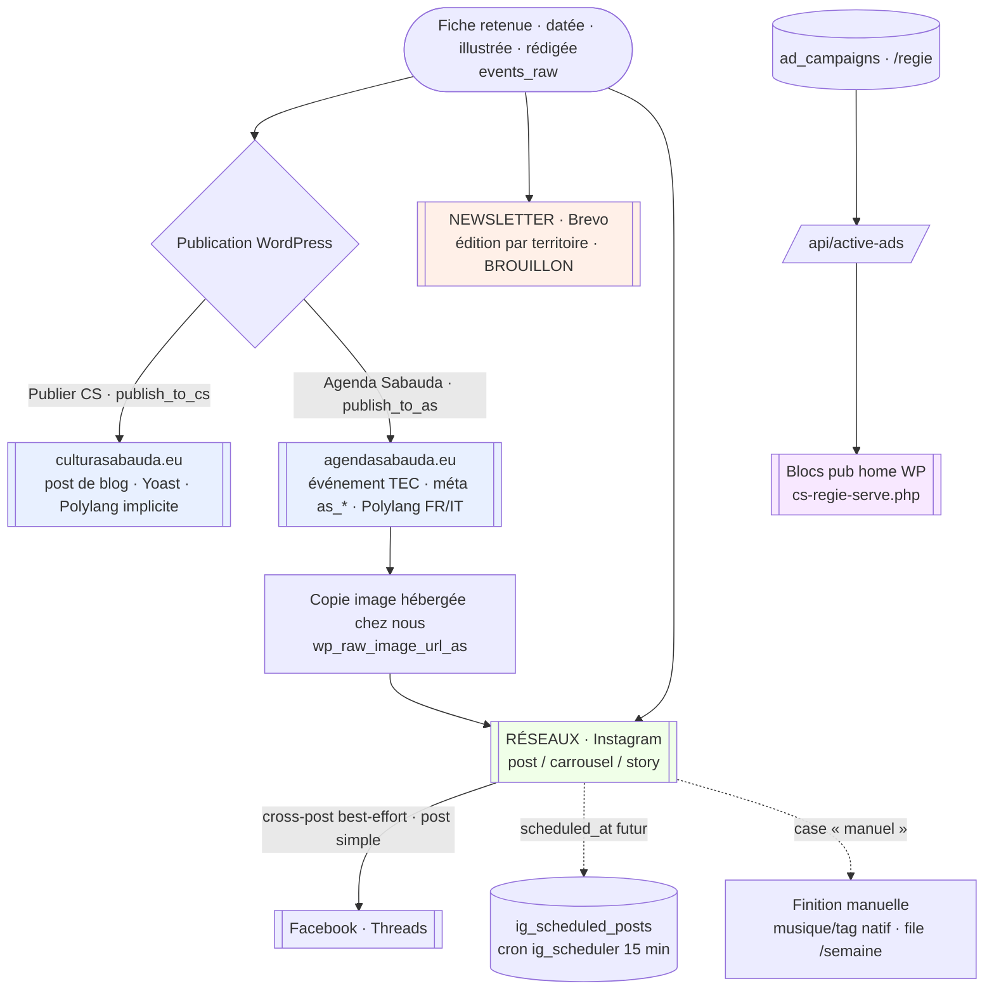
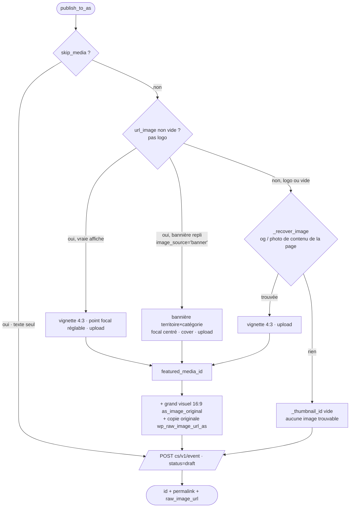
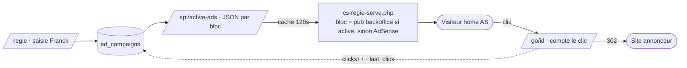

# La diffusion — comment une fiche sort vers ses canaux

*État des lieux du pipeline de diffusion de Cultura Sabauda / Agenda Sabauda (26 juillet 2026). Décrit le système RÉEL (tel qu'il est codé) : publication WordPress, newsletter, réseaux sociaux, régie publicitaire. Schémas + tables. Document de travail — à relire et amender.*

---

## 1. Le principe

Une fois qu'un événement est **retenu, daté, illustré, rédigé** (voir `IMAGES.md`, `TRADUCTION.md`), la **diffusion** le pousse vers **quatre familles de canaux**, chacune avec sa mécanique propre :

| Canal | Cible | Script/route | Coût LLM | Automatique ? |
|---|---|---|---|---|
| **Publication WP — Cultura Sabauda** | culturasabauda.eu (article de blog) | `scripts/publisher.py` (`publish_to_cs`) | 0 | Bouton « Publier CS » |
| **Publication WP — Agenda Sabauda** | agendasabauda.eu (événement TEC) | `scripts/publisher_as.py` (`publish_to_as`) | 0 | `autocomplete` (cron) + bouton « Agenda Sabauda » |
| **Newsletter** | Brevo, une édition **par territoire** | `scripts/newsletter.py` + route `/newsletter` | 0 (sélection déterministe) | Brouillon auto lundi ; envoi **toujours manuel** |
| **Réseaux (Instagram, +FB/Threads)** | comptes par territoire | `/reseaux/publish` + `scripts/ig_scheduler.py` | 0 par défaut (légende IA **à la demande**) | Clic ou programmation ; jamais en boucle |
| **Régie pub** | blocs pub de la home WP | `/regie*` + `/api/active-ads` | 0 | Saisie manuelle |

**Deux constantes de sécurité, partout :**
- **Rien ne se publie « en live » tout seul.** WordPress reçoit toujours `status=draft` (les deux publishers), Brevo reçoit un **brouillon** (jamais de `scheduledAt`, cf. `utils/brevo.py`), Instagram n'est jamais posté en boucle automatique.
- Le **radar** (source de presse) n'est **jamais crédité ni lié** (charte §8) : `url_source` est vidé sur les fiches radar dans chaque canal (`is_radar` / `_is_radar`).

### Schéma — les canaux de diffusion depuis une fiche

**Toutes les publications WordPress passent par un mu-plugin serveur** (auth de secours `X-CS-Auth` lue par `cs-rest-auth.php`, car beaucoup d'hébergeurs suppriment l'en-tête `Authorization` → `rest_not_logged_in`). L'Agenda Sabauda délègue en plus tout le travail TEC (`tribe_create_event`, lieu, taxonomies, image) au mu-plugin `cs-publish.php` (route `cs/v1/event`).

---

## 2. Publication WordPress — DEUX sites distincts

C'est le point le plus subtil : **deux publishers, deux sites, deux modèles de contenu**, qui partagent une partie du code.

| | `scripts/publisher.py` | `scripts/publisher_as.py` |
|---|---|---|
| **Site** | culturasabauda.eu | agendasabauda.eu |
| **Type de contenu** | `post` de blog WordPress natif | **événement The Events Calendar** (CPT `tribe_events`) |
| **Endpoint REST** | `/wp/v2/posts` (natif) | `cs/v1/event` (mu-plugin `cs-publish.php`) |
| **Variables .env** | `WP_URL`, `WP_USER`, `WP_APP_PASSWORD` | `WP_AS_URL`, `WP_AS_USER`, `WP_AS_APP_PASSWORD` |
| **Fonction publique** | `publish_to_cs(event) → wp_post_id` | `publish_to_as(event, skip_media) → (id, permalink, raw_image_url)` |
| **Bouton back-office** | « Publier CS » | « Agenda Sabauda » |
| **Champ id en base** | `wp_post_id_cs` | `wp_post_id_as` |
| **Taxonomies** | `categories` + `tags` natifs (`_resolve_term`) | `tribe_events_cat` + `territoire` (côté serveur) |
| **SEO** | Yoast (méta `_yoast_wpseo_*`) | Rank Math (`payload["seo"]`, côté serveur) |
| **Méta événementielles** | `event_*` (plates) | `as_*` (JetEngine lit ces champs) |
| **Langue Polylang** | implicite | **explicite** (`_lang()` → `language` FR/IT) |

**Code partagé** : `publisher_as` importe de `publisher` les briques éditoriales communes — `build_post`, `_map_category`, `_upload_featured_media` — pour garder **les mêmes règles** (charte §8 radar, mise en forme de l'article, nommage lisible des médias).

### 2.1 `build_post(event) → (titre, contenu HTML)`

Cœur commun aux deux sites. **Priorité à l'article enrichi** par l'agent (`enrich_data`, le JSON *titre/chapo/corps/programme/sources*) ; **repli sur la description brute** si l'événement n'a pas été rédigé.

- **Chapô** en gras, **corps** en HTML (markdown léger → `<h3>/<h4>/
`), **Programme** en `<ul>` (faits structurés : horaires, séances, line-up).
- **Sources** : uniquement des URL `http(s)` propres, dédupliquées, **jamais un lien vers nous-mêmes** (`agendasabauda.eu` exclu).
- **PAS d'encadré « En pratique »** dans la prose : le bloc Quand/Où/Tarif est rendu **nativement** par TEC (méta `as_*`) — le répéter ferait doublon.
- Le nettoyage déterministe `polish_prose` (tiret cadratin, gras sur chiffres — anti-signes-IA) s'applique **au moment du build**, donc pour les deux langues.

### 2.2 La featured media (`_upload_featured_media`)

On **téléverse l'image côté Python** dans la médiathèque WordPress plutôt que de laisser WordPress aller la chercher (souvent bloqué : hotlink/UA/firewall). La fonction est robuste :

- **Retry** sur échec transitoire du **téléchargement source** (429/5xx — Wikimedia sous charge) ET de l'**upload** (504/502 OVH) : sans retry, une bonne photo retomberait à tort sur la bannière.
- **Nom de fichier lisible** dérivé du titre (`_media_slug`) — jamais le hash opaque de l'URL source.
- Renseigne **alt** (SEO, expression clé), **caption** (crédit photo), **title** (sinon la médiathèque affiche le hash).
- `card=True` → standardise l'image (cover-focal ou letterbox, `utils/card_image`) au ratio demandé **avant** l'upload : **4:3** pour la vignette de grille, **16:9** pour le grand visuel « héros » de fiche.

**Différence de stratégie image entre les deux sites :**

- **CS** (`publisher.py`) : upload simple de `url_image` en featured media (pas de recadrage `card`), sans repli.
- **AS** (`publisher_as.py`) : chaîne à plusieurs étages —
  1. **vraie affiche** `url_image` → vignette 4:3 (point focal + mode réglés au back-office) ;
  2. **repli page source** (`_recover_image` → `fetch_content_image`) si l'affiche directe manque/échoue/est un logo ;
  3. **bannière territoire×catégorie** (`image_source == 'banner'`, posée en amont par `scripts/visuals.py` via `pick_banner_image`) : depuis le 2026-07-31, elle est téléversée **normalement** comme featured media (même chemin que la vraie affiche, focal centré + mode cover). Aucun repli WordPress/snippet ne « génère » l'image affichée — voir `IMAGES.md` §10.
- En plus, AS pose deux copies d'image utiles au reste du pipeline :
  - **`as_image_original`** (méta) : grand visuel 16:9 de la fiche (affiche entière, jamais un logo) ;
  - **`wp_raw_image_url_as`** : copie **originale non recadrée** hébergée chez nous → réutilisée par Instagram pour **ne pas retélécharger** depuis un site source protégé (Cloudflare).

### 2.3 Les champs méta

**CS — `event_*` + Yoast** (via `payload["meta"]`, lisibles en REST) :
`event_date_start`, `event_lieu`, `event_ville`, `event_territoire`, `event_categorie`, `event_organisateur`, `event_prix`, `event_url_source` (**vidé si radar**) ; puis `_yoast_wpseo_focuskw/title/metadesc`, Open Graph + Twitter, `excerpt`, `slug` — **seulement si l'étape SEO a tourné** (`seo_at`).

**AS — `as_*`** (JetEngine + carte-événement) :
`as_score`, `as_gratuit` (badge « entrée libre » déduit de `prix`), `as_tarif`, `as_horaire`, `as_billetterie_url`, `as_source_officielle_url` (**vidé si radar**), `as_verifie_le` (date du jour), `as_image_credit`, `as_image_original`, `as_lieu`, `as_ville`. Plus les champs natifs TEC : `start_date`/`end_date` (ISO ré-extrait par `_iso_dates` si besoin — **jamais** envoyer « 10 juin 2026 » brut, PHP retombe sur la date du jour), `venue`, `organizer`, `cost`, `website` (EventURL).

> **Tags AS = volontairement AUCUN** : `payload["tags"] = []` (liste vide pour nettoyer les tags auto hérités). Les tags LLM libres créaient du bruit SEO ; un vocabulaire contrôlé viendra plus tard.

### 2.4 Polylang (langue)

Sur AS seulement (site bilingue). `_lang(event)` :
1. **`force_lang`** si présent (cas des traductions : on impose, on ne devine pas) ;
2. sinon `utils.lang.detect_lang(titre, description, territoire)` (déterministe, cf. `TRADUCTION.md` §4).

La langue part dans `payload["language"]`, l'endpoint la pose côté Polylang → sélecteur de langue, archives par langue, `hreflang`. Les **traductions** ajoutent `force_create=True` (jamais de dédoublonnage : un titre en nom propre est souvent identique à l'original).

### Schéma — publication AS (résolution de l'image à la une)

---

## 3. Newsletter — édition par territoire (Brevo)

Reprend le gabarit « magazine » de l'Observatoire (`utils.newsletter_variants.variant_magazine`) : héros « À la une », sommaire « Aussi cette semaine », cartes « Le tour des territoires ». **Sélection 100 % déterministe (aucun LLM).**

### 3.1 Sélection des événements

`select_events()` (SQL, `scripts/newsletter.py`) : événements du **territoire** demandé (`NEWSLETTER_TERRITOIRE`, défaut « Savoie »), statut retenu (`evaluated`/`published_cs`/`published_sub`), non-doublon, qui **chevauchent la fenêtre** (par défaut J → J+7), triés `llm_score DESC`.

Puis `_split_temporal()` range en **trois seaux temporels** (comparaison lexicographique sur dates ISO) :

| Seau | Condition | Rendu |
|---|---|---|
| **ouvre** (le neuf) | `pfrom ≤ start ≤ pto` | **héros** (1er) + cartes détaillées (`MAX_CARDS=6`) |
| **dernière chance** | commencé avant, finit dans la fenêtre | sommaire compact (service factuel, pas d'urgence inventée) |
| **continue** | commencé avant, se poursuit après | sommaire « ça continue », **jamais héros** (`MAX_CONTINUE=6`) |

**Anti-répétition persistante** : un événement long n'est héros **qu'une fois** (keying par date d'ouverture) ; la table `newsletter_sent` retient ce qui a déjà été listé en sommaire (`_seen_continue_ids`) pour ne pas le remettre semaine après semaine. Le sommaire ordonne : dernière chance → surplus d'ouvertures → continue.

`build_item()` retombe sur la **bannière territoire×catégorie** si l'événement n'a pas d'image (aucune carte vide), affiche le **crédit** quand il existe, et **n'exploite jamais** `llm_justification` (texte interne de scoring, charte §11) — la cascade de résumé est chapô rédigé → description nettoyée.

### 3.2 Deux modes de composition

- **Automatique** (`temporal=True`) : cron lundi 7h → `newsletter.py` → seaux temporels → brouillon Brevo. Écrit aussi le **HTML exact** dans `logs/derniere_newsletter.html` et lance `_run_check`.
- **Manuel** (`temporal=False`, route `/newsletter` → `newsletter_brevo`) : Franck **choisit et ordonne** la sélection (table `newsletter_editions`, `picks_json`) ; l'ordre humain fait foi (héros = 1er, pas de re-tri). Listes Brevo **par territoire** (`_nl_list_ids`).

Dans les deux cas : `create_draft_campaign` crée un **BROUILLON** (jamais de `scheduledAt`) → **relecture et envoi manuels** par Franck depuis Brevo.

### 3.3 Le garde-fou `check_newsletter.py`

Contrôle le **HTML exact** avant envoi (bloquant = code retour 1). Détecte : **tirets cadratins** (charte), **images de presse/agrégateur** proscrites, **liens de traceur d'emailing** (ESP), **liens vers un journal** (radar interdit), `` au src vide, **placeholders de fusion** non remplis (`{{…}}` hors variables Brevo légitimes). Appelé aussi en soft depuis `newsletter.py::_run_check`.

---

## 4. Réseaux — Instagram (+ Facebook / Threads)

### 4.1 Deux chemins, une seule logique

L'API Graph d'Instagram **n'offre aucune programmation native** pour un outil tiers. Deux appelants partagent **exactement** la même mécanique :

- **Clic immédiat** — route `/reseaux/publish` → `app.py::_do_publish_instagram()` (**la source de vérité**) ;
- **Programmation** — `scripts/ig_scheduler.py` (cron **15 min**) reprend l'intention à l'heure dite. Il **duplique volontairement** le corps de `_do_publish_instagram` (car importer `app.py` démarre Flask + migrations). ⚠️ **Toute évolution de l'un doit être reportée sur l'autre.**

Un `scheduled_at` futur **n'est pas publié** : il est inséré dans `ig_scheduled_posts` (statut `pending`) et le cron le republie via le même chemin quand l'heure arrive et si l'événement est toujours complet.

### 4.2 Composition du visuel

Source image : **priorité à la copie hébergée chez nous** (`wp_raw_image_url_as`, posée au publish AS) plutôt qu'au site source (défi anti-robot Cloudflare détecté via l'en-tête `cf-mitigated`).

Deux moteurs de rendu, en cascade :

1. **`utils/social_overlay.py`** — si un **overlay du design system** existe pour le territoire (`assets/social_overlays/<slug>/<format>.png`) : on efface la bande de texte d'exemple (reconstruction du dégradé ligne par ligne), on redessine le **vrai** texte + la **puce territoire** par-dessus, on compose sur la photo. Renvoie `None` si pas d'overlay → repli sur (2).
2. **`utils/social_image.py`** — rendu 100 % Pillow (repli, ou territoires sans overlay) :
   - **`single_post`** carré 1080×1080, **`story`** 1080×1920, **`carousel`** 1080×1350 (accroche + détails + appel à l'action).
   - Recadrage via `utils/card_image` : **cover** pour une source portrait/carrée, **letterbox flouté** pour une source paysage (sinon coupe sévère). Photo trop petite (agrandissement > `MAX_UPSCALE = 1.5`) → **fond abstrait** couleur de marque plutôt que du flou.
   - Accent + libellé **par territoire**, puce « SAVOIE (DEPT. 73) » déduite de la ville (`config/communes_savoie_dept.json`).

Chaque slide est ré-uploadée dans notre médiathèque (`wp_media.upload_bytes`) puis passée à l'API Graph (`utils/instagram_publish.py`).

### 4.3 La légende (`utils/social.py`)

Gabarit **déterministe, gratuit, bilingue FR/IT**, sans invention (que des champs réels) :
- **Accroche DM** en 1re ligne (`_DM_CTA` : « commente XXX ») — déclencheur du webhook de réponse privée (`dm_keyword` déduit du titre, mots génériques exclus) ;
- accroche (`seo_answer` → titre), **📅 date** (`format_date` gère « jusqu'au … » pour un long événement déjà en cours), **📍 lieu · @organisateur** (handle **seulement s'il est confirmé** à la main, `utils/organizers`), CTA, **3 hashtags ciblés** (ville/catégorie/territoire prioritaires sur marque/mot large) ;
- **crédit image** (`image_credit_line`) ajouté en fin **seulement** pour une source licenciable (`og`/`page`/`commons`/`europeana`/`web`) — **jamais** pour une bannière maison.

Un second mode **`caption_ai()`** réécrit la légende via LLM (voix `utils.voix` + ton Enrico Nos Alpes + anti-signes-IA). **Appel PAYANT, à la demande** (bouton `/reseaux/rewrite`), mis en cache dans `social_caption_<lang>`. Une réécriture auto plafonnée existe (`_auto_rewrite_captions`) si le réglage `social_caption_auto` est activé.

### 4.4 Cross-post et mode manuel

- **Cross-post best-effort** (`RESEAUX_SOCIAUX_PLAN §4`) : après un **post simple** Instagram réussi, la même image + légende partent sur **Facebook** et **Threads** si le territoire est configuré (`utils/facebook_publish.py`, `utils/threads_publish.py`). Jamais bloquant, jamais d'échec IG à cause d'eux. Tout est journalisé dans `social_posts` (colonne `platform`).
- **Mode manuel** (`ig_manual_mode`) : pour la musique / le tag natif (impossibles via l'API, et tout appel API publie immédiatement). La case **n'appelle jamais l'API** : elle prépare légende + visuel sur `/preview` et laisse une tâche dans **`/semaine`** (`utils/semaine.py::tasks`) jusqu'à ce que Franck coche « C'est posté ».

Comptes et langues par territoire (`_RESEAUX_ACCOUNTS`) : Savoie/Haute-Savoie (fr), Piémont (it), Vallée d'Aoste (fr+it), Nice/Alpes-Maritimes (fr).

---

## 5. Régie publicitaire (`ad_campaigns`)

Petite régie **maison** pour vendre/gérer les blocs pub de la home Agenda Sabauda, en **surcouche d'AdSense** : quand un bloc a une campagne active, elle **remplace** le défaut AdSense ; sinon AdSense reprend la main.

### 5.1 Le modèle de données

Table **`ad_campaigns`** (créée à la volée par `_ensure_regie_table`, migration douce pour `clicks`/`last_click`) : `annonceur`, `bloc`, `format`, `url`, `image_url`, `date_debut`, `date_fin`, `tarif`, `note`, `statut` (`active`/`ended`), `clicks`, `last_click`.

Les **blocs vendables** sont figés dans `AD_BLOCKS` (app.py) : Leaderboard (1), Pavé in-article (2), Bandeau sticky (3), Skin (4) — avec dimensions, source (`adsense`/`manuel`) et prix base/lancement. `AD_PLAN` et `REGIE_SYSTEMS` documentent le plan complet des 12 emplacements et l'architecture (thème `agenda-sabauda-core`, Ad Inserter, shortcode `[cs_slot]`).

### 5.2 Le back-office `/regie`

CRUD complet : `/regie/add`, `/regie/edit/<id>`, `/regie/end/<id>` (échéance), `/regie/reactivate/<id>`, `/regie/delete/<id>`. La page marque les campagnes **expirées** (`date_fin` dépassée) et calcule un `occupied` (une campagne active par bloc) pour signaler les conflits. Compteur **`regie`** de campagnes actives remonté sur le dashboard.

### 5.3 Diffusion vers WordPress

Deux routes **publiques** (pas d'auth : les visiteurs doivent pouvoir voir/cliquer) :

- **`/api/active-ads`** — JSON lu par le module WordPress `cs-regie-serve.php` (avec cache 120 s, CORS `*`). Renvoie **par bloc** la créative active du jour (statut actif, dans la fenêtre de dates, `image_url` + `url` renseignées). **Un seul annonceur par bloc** (le plus récent l'emporte). Le lien pointe vers `/go/<id>` (pas l'URL annonceur directe).
- **`/go/<id>`** — **redirection comptée** : incrémente `clicks` + `last_click` puis renvoie (302) vers l'URL annonceur. **Pas d'open-redirect** : la destination vient de la base (posée par l'admin), jamais de l'URL entrante ; repli sur la home AS si absente.

### Schéma — la boucle régie

---

## 6. Où ça se déclenche (câblage)

Tout est piloté par `deploy/cron_pipeline.sh` (documenté en tête de fichier) et quelques crons séparés :

| Quand | Commande | Rôle de diffusion |
|---|---|---|
| Tous les jours 6h05 (`full`) | `cron_pipeline.sh` | En fin de chaîne : `autocomplete` (→ **publish_to_as** en brouillon) puis `translate_events --apply` (jumelles IT) |
| Lundi 7h00 | `cron_pipeline.sh newsletter` | **Brouillon** newsletter Brevo (Savoie par défaut) |
| Toutes les 15 min | `scripts.ig_scheduler` | Publie les posts Instagram **programmés** arrivés à échéance |
| Lundi 9h (ex.) | `scripts.semaine_reminder` | Rappel Slack de la file « Cette semaine » (dont finitions IG manuelles) |
| — (à la main) | Boutons back-office | « Publier CS » (`publish_to_cs`), « Agenda Sabauda » (`publish_to_as`), `/reseaux/publish`, `/regie/*` |

`autocomplete` pousse les fiches **complètes** en **brouillon WordPress** et signale le reste sur Slack — **rien n'est mis en ligne automatiquement**. La mise en ligne finale (bouton « Publier » de WordPress, envoi Brevo, post Instagram immédiat) reste **un geste humain**.

---

## 7. Points ouverts

- **Instagram : duplication `_do_publish_instagram` ↔ `ig_scheduler._publish`.** Deux copies à tenir synchronisées à la main (l'import d'`app.py` est trop coûteux pour factoriser). Risque de dérive silencieuse : toute évolution d'un chemin doit être reportée. À surveiller ; une extraction dans un module partagé (sans Flask) serait plus sûre.
- **Crédit image côté réseaux — désormais géré, à confirmer.** `social.image_credit_line()` ajoute bien le crédit au **texte** de la légende pour les sources licenciables. À vérifier sur des posts réels que le crédit n'est jamais dupliqué quand la légende IA (`social_caption_*`) le contient déjà (l'ajout n'est fait que « si absent », cf. `ig_scheduler`, mais pas systématiquement côté `_do_publish_instagram`).
- **Newsletter automatique mono-territoire.** Le cron lundi 7h ne génère qu'**un** territoire (`NEWSLETTER_TERRITOIRE`, défaut Savoie). Les autres versants (Piémont, Vallée d'Aoste, Nice) ne partent qu'en **composition manuelle** (`/newsletter`). Ouvrir une boucle par territoire (ou un mode `--territoire`) si on veut couvrir les 4 automatiquement.
- **Régie `cs-regie-serve.php` pas encore déployée.** L'API `/api/active-ads` répond (HTTP 200), mais l'enveloppe `[cs_slot]` autour de chaque bloc AdSense reste à poser côté thème (cf. `REGIE_SYSTEMS`). Tant que ce n'est pas fait, l'override backoffice n'est pas effectif sur tous les blocs.
- **Régie : un seul annonceur par bloc.** `/api/active-ads` ne renvoie que la campagne la plus récente par bloc — pas de rotation ni de A/B. Suffisant au lancement, à revoir si plusieurs annonceurs se partagent un emplacement.
- **Publication CS moins outillée que AS pour l'image.** `publisher.py` n'a ni récupération depuis la page source (`_recover_image`), ni recadrage `card`, ni anti-bake bannière. Si CS redevient un canal actif, aligner sa gestion d'image sur celle d'AS.
- **Cross-post limité au post simple.** Facebook/Threads ne reçoivent que le **single** (pas les carrousels ni les stories). Choix assumé pour l'instant ; à élargir si la demande vient.
