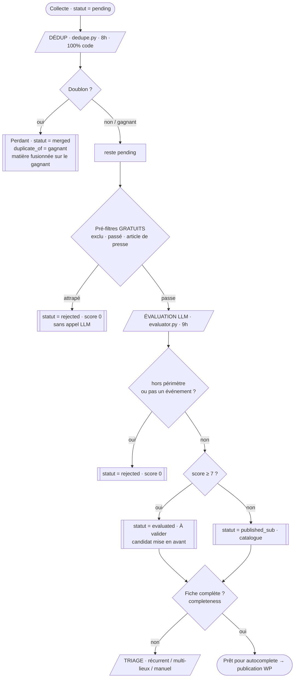
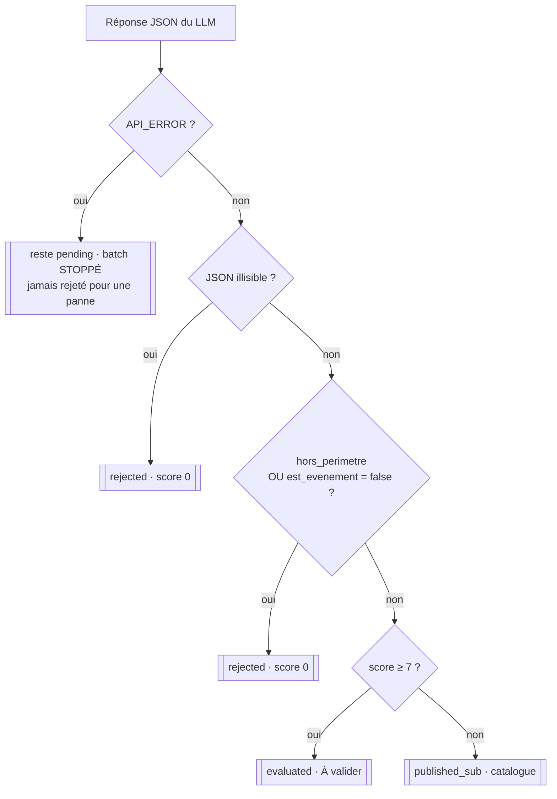
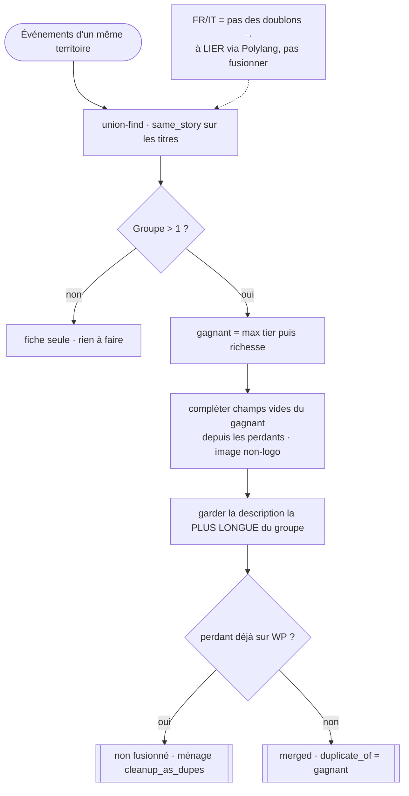

# L'évaluation & la déduplication — comment on trie et on regroupe les événements

*État des lieux du pipeline de tri de Cultura Sabauda / Agenda Sabauda (26 juillet 2026). Décrit le système RÉEL (tel qu'il est codé) : comment un événement collecté est jugé (score LLM), comment les doublons multi-sources sont fusionnés, et comment on débloque les fiches incomplètes. Document de travail — à relire et amender.*

---

## 1. Le principe

Chaque jour, la collecte (`scraper_events.py`, `gmail_collect.py`) déverse des centaines d'événements bruts en `statut='pending'`. Avant d'en faire un article ou un post, il faut **trier** : est-ce dans nos 4 territoires ? est-ce un vrai événement ou un article de presse ? mérite-t-il la mise en avant ou le catalogue ? Et il faut **ne pas payer deux fois** le même événement arrivé par trois flux.

Trois étages, dans l'ordre du cron quotidien :

1. **DÉDUP** (`dedupe.py`, 8h) — 100 % déterministe : regroupe les doublons, garde une fiche canonique, fusionne la matière. Passe **avant** l'évaluation pour ne pas payer le LLM sur des doublons.
2. **ÉVALUATION** (`evaluator.py`, 9h) — le seul étage LLM : périmètre + gate + score d'importance 0-10 → décide `rejected` / `evaluated` / `published_sub`.
3. **TRIAGE** (`utils/triage.py` + routes `/triage`) — déblocage déterministe des fiches retenues mais incomplètes (récurrent / multi-lieux / manuel).

**Répartition LLM / code (charte `docs/LLM_OU_CODE.md`)** : le LLM ne fait que le **jugement éditorial** (l'évaluation). La dédup, le triage, la porte qualité et tous les seuils restent **déterministes**.

### Schéma — le cycle éval → dédup → statut

---

## 2. L'évaluation LLM (`scripts/evaluator.py`)

Le cœur du jugement éditorial. SDK **anthropic direct** (pas de LiteLLM), cron `0 9 * * *` (9h, après le scraping de 8h et la dédup). Ne traite que les `statut='pending'`, par lots de `BATCH_SIZE = 100`.

### 2.1 Le modèle et le coût

Le modèle vient du réglage back-office `/reglages` (`utils.settings.model()`) :

| Profil (`ai_profile`) | Modèle | Tarif entrée / sortie (USD / M tokens) |
|---|---|---|
| `eco` (défaut) | `claude-haiku-4-5` | 1,0 / 5,0 |
| `qualite` | `claude-sonnet-5` | *(voir §8 — non listé dans `PRICES`, retombe sur le défaut 3,0 / 15,0)* |

L'env `ANTHROPIC_MODEL`, si posée, **reste prioritaire** (échappatoire power-user). `DEFAULT_MODEL = "claude-sonnet-5"` dans le script n'est qu'une constante historique — le vrai choix passe par `settings.model()`.

**Économie par cache** : les instructions (le gros prompt `EVAL_PROMPT`, constant sur un run) partent en **système avec `cache_control: ephemeral`**. Seul le **bloc événement** (titre / description tronquée à 800 car. / lieu / source) change d'un appel à l'autre et part en message *user*. L'énorme prompt d'instructions n'est donc **refacturé qu'une fois par run**, pas par événement. Chaque appel : `max_tokens=1536`, mesuré par `utils.usage.record_message`.

### 2.2 Les pré-filtres GRATUITS (avant tout appel LLM)

Trois gardes déterministes rejettent **sans payer** — dans cet ordre :

| Garde | Fonction | Rejet posé |
|---|---|---|
| Règle éditoriale explicite | `is_excluded_event` (`config/excluded_event_keywords.txt`, ex. « jamais le 27e BCA ») | `Exclu par règle éditoriale.` |
| Événement déjà passé | `is_past_event` (date de fin, ou début à défaut, < aujourd'hui) | `Événement passé (déjà terminé).` |
| Article de presse | `non_event_reason` (`utils.eventness` : « où se garer », « le conseil s'est réuni », « caravane publicitaire »…) | `Article de presse, pas un événement : …` |

Ces filtres visent le **PIÈGE PRESSE** : le LLM s'accroche à un gros mot-clé (« Tour de France ») et note haut un article *au sujet d'*un événement. On coupe avant l'appel, en haute précision.

### 2.3 La grille de jugement (le prompt `EVAL_PROMPT`)

Le prompt fait descendre l'événement par trois étapes :

- **ÉTAPE 0 — PÉRIMÈTRE** : où l'événement se déroule-t-il VRAIMENT ? Les 4 territoires : **Savoie/Haute-Savoie (73/74)**, **Piemonte**, **Vallee-Aoste**, **Nice/06**. Un lieu cité en passant (tournée, comparaison) ne compte pas. Hors des 4 → `hors_perimetre: true`, score 0. C'est une **2e garde** après le filtre mots-clés du scraper (rattrape le lieu débordant que le match laisse passer).
- **ÉTAPE 1 — GATE** : est-ce un événement auquel le public peut ASSISTER, daté, dans un lieu ? Sinon (actu institutionnelle, réunion, inauguration passée, travaux) → `est_evenement: false`, score 0. Rappel du piège presse.
- **ÉTAPE 2 — SCORE D'IMPORTANCE (0-10)** : PAS de profondeur culturelle exigée — on mesure si l'événement **compte** (va réunir du monde). Somme de 5 critères :

| Critère | Points | Ce qui donne le max |
|---|---|---|
| `notoriete_lieu` | 0-3 | lieu emblématique très cité (grand stade, opéra, grand musée) ; pondéré par la taille de la commune |
| `organisateur_moyens` | 0-2 | institution / gros opérateur / grand festival |
| `edition_tradition` | 0-2 | rendez-vous historique / édition élevée / anniversaire |
| `rayonnement` | 0-2 | international ou transfrontalier FR-IT |
| `specificite_territoriale` | 0-1 | identitaire, propre au territoire (0 = franchise générique) |

On **n'exclut pas** le grand public, le sport, la gastronomie, les marchés. On écarte (score bas) seulement le **très confidentiel** et le **purement commercial** (salon de vente). Le méga-concert de tournée est admis mais sans bonus « territoire ».

**Catégorie** : le LLM en choisit UNE parmi les 11 (`CATEGORIES`) : *Expositions & Patrimoine, Concerts & Musique, Spectacle vivant, Festivals, Gastronomie & Sagre, Marchés & Foires, Sport, Cinéma, Jeune public & Famille, Conférences & Rencontres, Fêtes & Traditions populaires*.

Le modèle répond en **JSON strict** (extrait par `re.search(r"\{.*\}")`, tolère un bloc de raisonnement en tête).

### 2.4 Le calibrage (la mémoire des corrections de Franck)

`score_memory.calibration_block()` relit les dernières corrections de score faites par Franck au back-office (`data/score_feedback.jsonl`, append-only, écrit par `score_memory.record`) et les **injecte dans le prompt système** comme exemples : « — "…" (catégorie · territoire · lieu) → Franck a mis 8/10 (l'IA proposait 5) ». Au fil du temps, l'évaluateur **s'aligne sur son goût**, sans que ce soient des règles absolues. Le bloc restant stable sur un run, il profite du cache système.

### 2.5 La décision de statut et l'écriture

Le sentinel `API_ERROR` (panne réseau / statut) **ne touche pas au statut** (reste `pending`, réévalué au prochain run) et **stoppe le batch** (l'API est probablement KO). Un vrai événement n'est **jamais** rejeté d'office pour une panne.

À l'écriture (`UPDATE events_raw`), l'évaluateur pose : `llm_score`, `llm_categorie`, `llm_justification`, `llm_score_detail` (le JSON des critères), `llm_model`, `llm_evaluated_at`, `statut`, et **corrige `territoire`** si la source l'a mal étiqueté (ex. Le Dauphiné « Savoie » pour un événement d'Annecy → valeur canonique parmi `TERRITOIRES`).

**Périmètre optionnel** : `--from`/`--to` circonscrit l'évaluation aux événements qui **chevauchent** une fenêtre datée — « le statut pilote le coût », on ne paie que ce qu'on va travailler.

---

## 3. La déduplication (`scripts/dedupe.py`)

Un même événement arrive souvent par plusieurs flux (officiel + radar + office de tourisme). On regroupe, on garde une fiche **canonique**, et on **fusionne sans rien perdre**. **100 % déterministe, aucun LLM.** Cron `0 8 * * *` (avant l'éval de 9h — évite de payer le LLM sur des doublons).

### 3.1 L'appariement (union-find par territoire)

`_groups()` compare les titres **uniquement à l'intérieur d'un même `territoire`** (perf + sens), et unit deux événements si :

- **`same_story(a, b)`** (`utils.sources`) : un **nom propre distinctif partagé** (majuscule interne : « RareEarth », « Mont-Blanc ») **OU** ≥ 3 mots significatifs communs, en ignorant les noms de lieux.
- **OU**, seulement si `--cross-lang` est passé, **`cross_lang_same(a, b)`** (voir §3.3).

### 3.2 Le choix du gagnant et la fusion de la matière

`score(ev) = (priorité de tier, richesse)` — le **tier prime**, la richesse départage :

| Tier de source (`TIER_RANK`) | Rang |
|---|---|
| `officielle` | 3 |
| `institution` / `institutionnel` | 2 |
| `tourisme` | 1 |
| `radar` | 0 |

`richness(ev)` (mesurable, sans LLM) : **+25** si `url_image`, **+ longueur description // 50** (plafonnée à 2000 car.), **+5** par champ structuré présent (`date_start`, `lieu`, `ville`, `organisateur`), **+15** si `url_source` réelle (pas `news.google.com`).

`merge_group()` prend `winner = max(group, key=score)` puis **préserve toute la matière** :

1. **Champs structurés manquants** du gagnant complétés depuis les perdants les plus riches — l'image seulement si elle n'est pas un logo (`is_logo_image`).
2. **MATIÈRE textuelle** : on garde la **description la PLUS LONGUE du groupe**, même venue d'un radar gratuit → la rédaction pourra puiser dans tout.
3. Les perdants passent en **`statut='merged'`, `duplicate_of=winner`** — jamais supprimés.

**Garde-fou** : un perdant **déjà poussé sur l'agenda** (`wp_post_id_as` renseigné) n'est **pas** fusionné ici (ça laisserait un brouillon WordPress orphelin) — le ménage se fait côté WP via `scripts.cleanup_as_dupes`.

`--rescan` élargit aux événements déjà retenus (`evaluated`, `published_cs`, `published_sub` avec `duplicate_of IS NULL`) pour nettoyer le stock existant **en même langue**.

### 3.3 Pourquoi le dédup reste MONO-LANGUE (lien avec la traduction)

Par défaut `cross_lang=False`. **Sur un site bilingue, les versions FR et IT d'un même événement ne sont PAS des doublons** — ce sont deux traductions à **lier** via Polylang (+ `hreflang`), pas à fusionner. Fusionner détruirait la paire de langue. C'est exactement le rôle du **mécanisme B de `link_translations_as.py`** (voir `docs/TRADUCTION.md` §3) : apparier et relier les jumelles bilingues déjà publiées, sans LLM.

La fonction inter-langue **existe** (`cross_lang_same`) mais n'est activée qu'avec le drapeau explicite `--cross-lang`, **déconseillé** sur ce site. Elle est conservatrice : elle rapproche par les **tokens significatifs** (noms propres, années — invariants d'une langue à l'autre), après avoir retiré les mots-outils ET les mots génériques d'événement qui, eux, changent de langue (`festa`/`fête`, `sagra`, `concerto`/`concert`…). Conditions : ≥ 2 mots distinctifs communs (hors années), Jaccard ≥ 0,5, années compatibles (deux éditions d'années différentes ne fusionnent jamais).

---

## 4. Le triage / déblocage (`utils/triage.py` + routes `/triage`)

**Constat (validé avec Franck)** : la file « À compléter » stagne parce qu'elle mélange des causes de blocage très différentes, dont plusieurs ont **déjà une solution** dans le back-office — il suffit de l'appliquer.

`triage.py` **ne complète rien et n'invente aucune donnée** : il **détecte** la cause probable à partir du texte pour proposer la bonne action **en 1 clic**. Pur calcul sur une ligne `events_raw` + `utils.completeness`.

### 4.1 La porte qualité (`utils/completeness.py`)

Un événement ne part sur l'agenda que s'il a TOUS ses champs `MANDATORY` : **Date, Lieu, Ville, Territoire, Catégorie, Image**. Deux relaxations éditoriales lèvent une exigence :

| Relaxation | Effet sur `missing_fields` |
|---|---|
| `recurring=1` | la **Date** n'est plus requise (remplacée par une note renvoyant à la source, `recurring_note`) |
| `multi_lieux=1` | **Lieu ET Ville** ne sont plus requis (festival itinérant / programme diffus) |

### 4.2 La classification (`classify`)

Pour une fiche incomplète, `classify()` renvoie un dict prêt pour le template :

| Clé | Sens |
|---|---|
| `suggest_recurring` | la **Date** manque **ET** le texte contient un indice de permanence (`RECURRING_HINTS` : « toute l'année », « sur réservation », « tutto l'anno »…) |
| `suggest_multi` | **Lieu ou Ville** manque **ET** indice d'itinérance (`MULTI_HINTS` : « plusieurs communes », « hors les murs », « in tutta la valle »…) |
| `residual` | libellés qui resteront manquants **même après** les cases → vraie donnée à trouver, ou fiche à rejeter |
| `primary` | `recurring` \| `multi_lieux` \| `both` \| `manual` |
| `resolved_by_flags` | `True` si cocher les cases **suffit** à compléter la fiche (gain immédiat) |

Indices FR **et** IT, normalisés sans accents (`_norm`).

### 4.3 Les routes (`app/app.py`)

- **`GET /triage`** : range les fiches incomplètes en 4 seaux (`recurring`, `multi_lieux`, `both`, `manual`) via `classify`, compte le total et le nombre **`resolvable`** (cases suffisantes). Rendu `triage.html`.
- **`POST /triage/apply`** : applique **en lot** une relaxation (`recurring` → `recurring=1`, ou `multi_lieux` → `multi_lieux=1`) à toutes les fiches où le triage la suggère. **Réversible**, ne publie rien, n'invente rien. La suggestion est **re-calculée au moment de l'action** (pas de confiance aux ids venus du formulaire).

Les 4 causes visées : **date manquante + langage permanent → RÉCURRENT** ; **lieu/ville manquants + langage itinérant → MULTI-LIEUX** ; **source morte / périmée → REJETER** ; **ambiguïté / conflit → un humain tranche**.

---

## 5. Les statuts et les seuils

### 5.1 Cycle de vie d'un statut (`events_raw.statut`)

| Statut | Libellé back-office | Posé par | Sens |
|---|---|---|---|
| `pending` | En attente | collecte | à évaluer |
| `merged` | Fusionné | `dedupe` | doublon rattaché (`duplicate_of`) |
| `rejected` | Rejeté | pré-filtres / éval / purges | hors périmètre, passé, article, exclu |
| `evaluated` | À valider | éval (score ≥ 7) | retenu, candidat mise en avant |
| `published_sub` | Agenda Sabauda | éval (score < 7) | retenu, catalogue (site dédié) |
| `published_cs` | Cultura Sabauda | action back-office `publish_cs` | brouillon WordPress créé |

Les trois statuts **RETENUS** (`completeness.RETAINED_STATUTS` = `evaluated`, `published_cs`, `published_sub`) sont les seuls concernés par la porte qualité, l'autocomplete, l'enrichissement, le SEO, la traduction — toujours filtrés avec `duplicate_of IS NULL`.

### 5.2 Les seuils qui comptent

| Seuil | Valeur | Où | Effet |
|---|---|---|---|
| Score « mise en avant » | **≥ 7** | `evaluator.py` | `evaluated` vs `published_sub` |
| `ENRICH_MIN_SCORE` | **7** (env) | `enrich.py` / `app.py` | ≥ 7 → article long ; sinon court (mode `auto`) |
| `autocomplete --min-score` | **0** (défaut) | `autocomplete._select` | plancher de complétion (toute la masse retenue) |
| `translate --min-score` | **6** (défaut) | `translate_events.py` | plancher de traduction (voir `docs/TRADUCTION.md`) |
| `BATCH_SIZE` | **100** | `evaluator.py` | événements évalués par run |

La sélection de l'autocomplete (`_select`) est représentative de la « suite » du pipeline : `statut IN ('evaluated','published_cs','published_sub')` **ET** `duplicate_of IS NULL` **ET** `COALESCE(llm_score,0) >= min_score`, triée par score décroissant. La dédup (`merged`) et l'évaluation (`rejected`/score) **filtrent donc en amont tout ce que la suite paierait**.

---

## 6. Qui fait quoi (scripts & modules)

- **`scripts/evaluator.py`** — l'évaluateur LLM : pré-filtres gratuits, prompt `EVAL_PROMPT`, `evaluate_event`, décision de statut, correction de territoire.
- **`scripts/dedupe.py`** — la dédup déterministe : `_groups` (union-find), `score`/`richness`, `merge_group`, `cross_lang_same`.
- **`utils/sources.py`** — `same_story` (appariement mono-langue), `is_logo_image`, tiers de source.
- **`utils/triage.py`** — `classify` : détection récurrent / multi-lieux / manuel.
- **`utils/completeness.py`** — la porte qualité : `MANDATORY`, `missing_fields`, `is_complete`, `RETAINED_STATUTS`.
- **`utils/score_memory.py`** — la mémoire de calibrage (corrections de Franck → prompt).
- **`utils/eventness.py` / `utils/sources.py`** — `non_event_reason`, `is_excluded_event` (pré-filtres gratuits).
- **`utils/usage.py`** — comptage et coût (`PRICES`, `record_message`, `cost_of`).
- **`utils/settings.py`** — profil `eco`/`qualite` → modèle d'évaluation.
- **`scripts/autocomplete.py`** — consomme les retenus complets (sélection `_select`), applique la porte qualité.
- **`app/app.py`** — routes `/triage`, `/triage/apply`, action `publish_cs`, libellés de statut.

---

## 7. Où ça se déclenche (câblage)

- **Cron quotidien** — dans l'ordre : **dédup 8h** (avant de payer l'éval) → **éval 9h** → puis visuels, enrichissement, autocomplete, traduction (cf. `docs/IMAGES.md` §7 et `docs/TRADUCTION.md` §7).
- **Back-office** — page `/reglages` (profil `eco`/`qualite` = modèle d'éval) ; file « À valider » (les `evaluated`) ; ajustement manuel du score (nourrit `score_memory`) ; **`/triage`** pour débloquer en lot ; action **`publish_cs`** (crée le brouillon WordPress, pose `published_cs`).
- **Manuel (VPS)** — `python -m scripts.evaluator [--from --to]`, `python -m scripts.dedupe [--rescan] [--cross-lang]`.

---

## 8. Points ouverts

- **`PRICES` ne couvre pas `claude-sonnet-5`.** Le profil `qualite` et le `DEFAULT_MODEL` du script utilisent l'identifiant `claude-sonnet-5`, mais `utils/usage.py → PRICES` ne connaît que `claude-sonnet-4-6` et `claude-opus-4-8` / `claude-haiku-4-5`. Un run en `qualite` retombe donc sur `_DEFAULT_PRICE (3,0 / 15,0)` — probablement juste par coïncidence, mais le **coût affiché n'est pas garanti exact**. À aligner (ajouter `claude-sonnet-5` à `PRICES`).
- **`DEFAULT_MODEL = "claude-sonnet-5"` mort.** La constante n'est jamais utilisée (le modèle vient de `settings.model()` ou de l'env). À supprimer pour éviter la confusion.
- **Seuil unique `≥ 7` en dur.** La bascule `evaluated` / `published_sub` est codée en dur dans l'évaluateur (pas un réglage). Elle coïncide avec `ENRICH_MIN_SCORE` (7, mais côté enrichissement c'est un env), sans source de vérité commune. À centraliser si on veut piloter la sévérité sans toucher au code.
- **Dédup mono-langue et fenêtre temporelle.** `same_story` n'exige pas de proximité de **dates** : deux éditions annuelles au même titre dans le même territoire peuvent être appariées si les titres ne portent pas l'année. La garde « années » n'existe que côté `cross_lang_same`. À surveiller si un cas de fusion à tort d'éditions successives apparaît.
- **Pré-filtre « passé » et événements récurrents.** `is_past_event` rejette sur la date de fin/début ; un événement récurrent mal daté (date d'une édition révolue au lieu de « permanent ») pourrait être rejeté à l'éval **avant** que le triage ne le passe en `recurring`. L'ordre du pipeline (éval avant triage) mérite un œil.
- **Le triage ne détecte pas la « source morte ».** `classify` couvre récurrent / multi-lieux / manuel, mais la 4e cause identifiée dans la docstring (source morte / périmée → REJETER) n'a **pas** de détection ici : le test HTTP est fait ailleurs (il demande le réseau). L'action « rejeter » reste donc manuelle dans la file `manual`.
