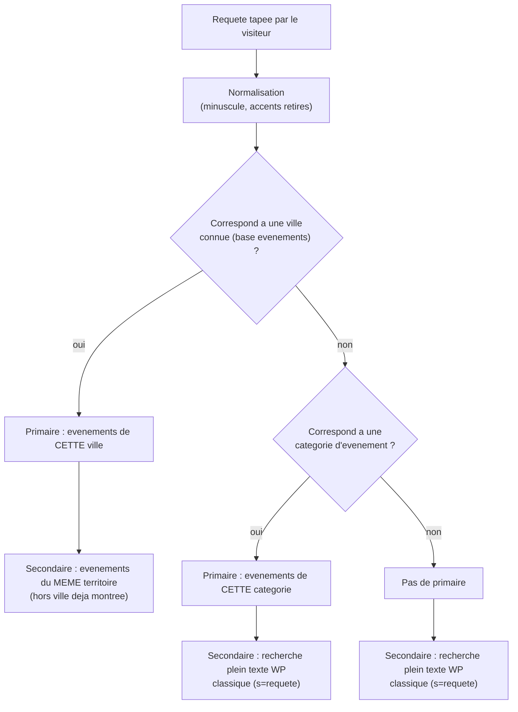

# Agenda Sabauda : la recherche (as-built)

> Document de référence technique. Décrit ce qui est réellement construit et
> live pour la page de recherche. Complète `docs/TEMPLATES_WORDPRESS.md` §B.10
> et `docs/INTENTIONS_RECHERCHE_SEO.md` (stratégie SEO, pas technique).
>
> Dernière mise à jour du code décrit : 2026-07-24.

---

## 0. ⚠️ Piège du même type que la fiche événement : un filtre probablement mort

Deux snippets actifs sur la recherche :

| Snippet | Nom | Mécanisme | Statut |
|---|---|---|---|
| 18 | CS Recherche (inclut événements) | `pre_get_posts` + `the_excerpt` (Boucle WP **native**) | **Probablement mort en partie** |
| **23** | CS · Gabarit Recherche | `template_redirect` sur `is_search()`, rendu complet | **LIVE** — confirmé (placeholder détecté en direct) |

Le snippet 23 fait sa propre boucle complète (`get_header()` + rendu manuel +
`get_footer()` + `exit`), avec ses **propres objets `WP_Query`** distincts,
et affiche les événements via `cs_card_compact()` directement — **sans jamais
appeler `the_excerpt()`**. Le filtre `the_excerpt` du snippet 18 (qui ajoutait
une pastille date+territoire sous chaque résultat événement) ne peut donc
**jamais se déclencher** sur la page de recherche réellement affichée.

**Non vérifié avec certitude** (contrairement au cas des badges, corrigé après
vérification) : le `pre_get_posts` du snippet 18 (élargit `post_type` à
`tribe_events`) pourrait encore avoir un effet résiduel sur la requête
principale WordPress, même si le snippet 23 ne s'en sert pas pour construire
son affichage — à vérifier si on veut nettoyer ce snippet.

**Ce que fait réellement le snippet 18 aujourd'hui, avec certitude** : rien
de visible. Toute la présentation (y compris la pastille date/territoire) est
gérée en interne par `cs_card_compact()` (snippet 21) via le rendu du
snippet 23.

---

## 1. Vue d'ensemble : recherche « contextuelle en 2 niveaux »

Contrairement à une recherche plein texte classique, la page essaie d'abord
de **comprendre l'intention** de la requête avant de chercher :



Dans tous les cas, une section **« Pages & guides »** (pages statiques,
guides, hubs ville) s'affiche en plus si des résultats WordPress classiques
(`s=`) existent sur `post`/`page`.

Si rien du tout : message « Aucun résultat » + 2 raccourcis (Ce week-end /
Tout l'agenda).

---

## 2. Reconnaissance de ville : `cs_search_city_map()`

**Pas une liste figée de villes.** La correspondance requête → ville est
calculée dynamiquement à partir des **vraies données événements** en base :

```sql
SELECT vm.meta_value AS city, tt.term_id, COUNT(*)
FROM postmeta (EventVenueID) JOIN postmeta (_VenueCity)
JOIN term_relationships/term_taxonomy (territoire)
JOIN posts (tribe_events, publish)
GROUP BY city, territoire
```

Pour chaque ville trouvée, le territoire **majoritaire** (le plus fréquent
parmi ses événements) lui est associé — une ville n'a donc qu'un seul
territoire « propriétaire » même si elle a, en théorie, des événements classés
dans plusieurs.

- **Normalisation** (`cs_search_norm()`) : minuscule + accents retirés
  (à→a, é→e, ç→c, etc.), pour que « chambery » retrouve « Chambéry ».
- **Score de correspondance** (`cs_search_match_city()`) :
  - correspondance exacte → score 1000+
  - la ville est **contenue dans** la requête (ville ≥ 4 caractères, ex.
    requête « restaurants chambery ce soir » contient « chambery ») → score
    500+
  - la requête est un **début** du nom de ville (≥ 4 caractères) → score 200+
  - le meilleur score gagne.
- **Cache** : `transient` `cs_search_city_map_v1`, régénéré toutes les 12h
  (`12 * HOUR_IN_SECONDS`) — la requête SQL d'agrégation n'est donc pas
  relancée à chaque recherche visiteur.

---

## 3. Reconnaissance de catégorie

Si aucune ville ne matche, comparaison de la requête (normalisée) contre les
noms de **toutes** les catégories `tribe_events_cat` existantes (correspondance
exacte normalisée, ou sous-chaîne insensible à la casse `stripos`).

---

## 4. Ce qui s'affiche selon le cas

| Cas | Section primaire | Section secondaire |
|---|---|---|
| Ville reconnue | Événements de cette ville (60 max scannés, filtrés) | Événements du même territoire, hors cette ville (12 max) |
| Catégorie reconnue | Événements de cette catégorie (30 max) | Recherche plein texte WP classique (20 max) |
| Ni l'un ni l'autre | — | Recherche plein texte WP classique (20 max) |
| Requête vide | — | **Raccourcis** (voir §5) au lieu de résultats |

Toujours en plus, si pertinent : section **« Pages & guides »** (10 max,
`post`+`page`, texte plein), avec une étiquette par résultat (Ville / Guide /
Article / Page) déduite des metas (`cs_hub_ville`, `cs_guide_territoire`).

---

## 5. Raccourcis (recherche vide)

Quand le champ de recherche est vide (page de recherche visitée directement,
ex. depuis le menu), affichage de raccourcis plutôt qu'une liste vide :

1. Ce week-end (lien vers la home filtrée week-end)
2. Les 4 territoires (Savoie, Piémont, Vallée d'Aoste, Comté de Nice — labels
   et permaliens résolus dynamiquement via `cs_terr_canon_data()` +
   `pll_get_post()` pour la version IT)
3. Concerts & Musique (catégorie fixe, terme 13 FR, traduit dynamiquement en IT)

---

## 6. Bilingue

Corrigé en même temps que la refonte du 2026-07-23 (commentaire du snippet :
« était FR-only malgré `is_search()` bilingue ») — tous les libellés
(placeholder, étiquettes de section, message vide) passent désormais par un
tableau `$LB` FR/IT selon `pll_current_language()`, plus la reconnaissance
ville/catégorie qui utilise les **termes propres à la langue courante**
(`fr_term`/`it_term` selon le cas).

---

## 7. Dépendances

- `cs_search_norm()`, `cs_search_city_map()`, `cs_search_match_city()` —
  internes au snippet 23.
- `cs_terr_canon_data()` — mu-plugin `cs-territoire-persistant.php`.
- `cs_card_compact()` — snippet 21.
- Metas lues : `cs_hub_ville`, `cs_guide_territoire` (pour étiqueter les
  résultats « Pages & guides »).

---

## 8. Écarts / points d'attention

- Snippet 18 à auditer/nettoyer (§0) — écrit pour un usage qui n'est
  vraisemblablement plus le chemin live depuis le 2026-07-23.
- La reconnaissance de ville dépend entièrement de la qualité du champ
  `_VenueCity` des lieux en base (`tribe_venue`) — une ville mal orthographiée
  ou absente de ce champ sur un lieu n'apparaîtra jamais dans
  `cs_search_city_map()`.
- Le cache de 12h (`cs_search_city_map_v1`) signifie qu'un nouveau lieu/ville
  ajouté en base peut mettre jusqu'à 12h avant d'être reconnu par la
  recherche.
