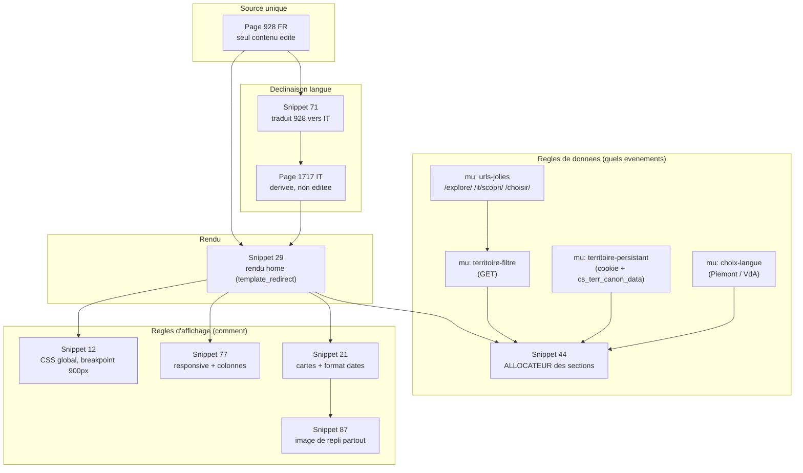
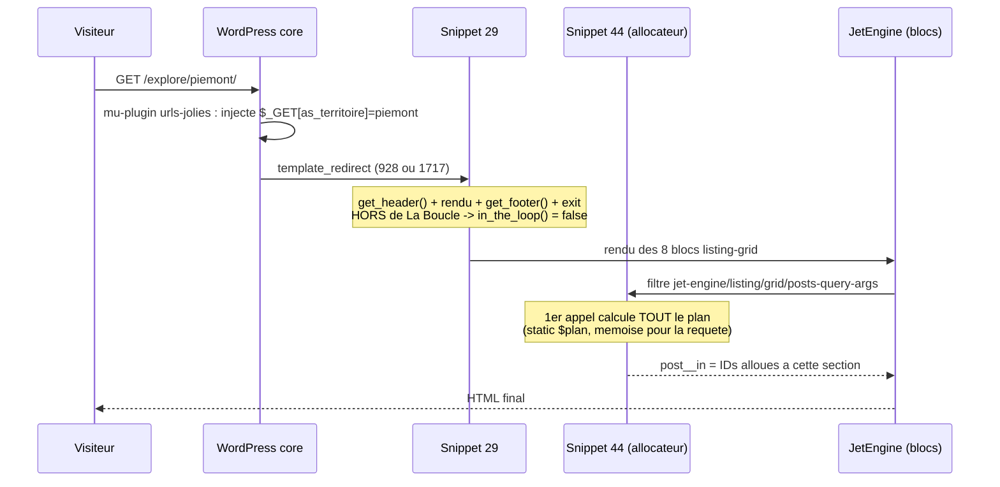
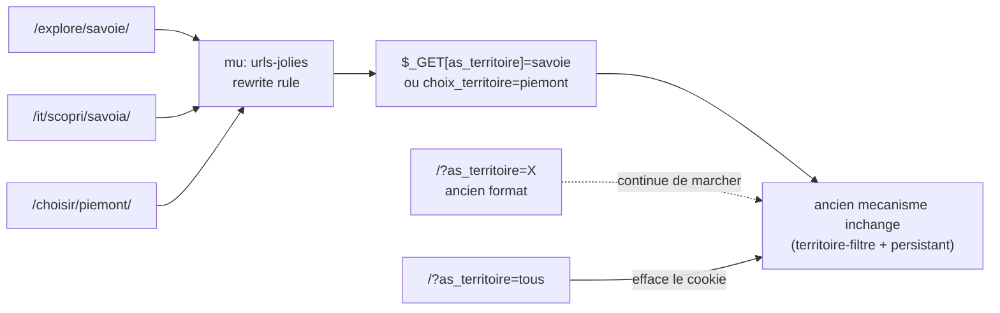
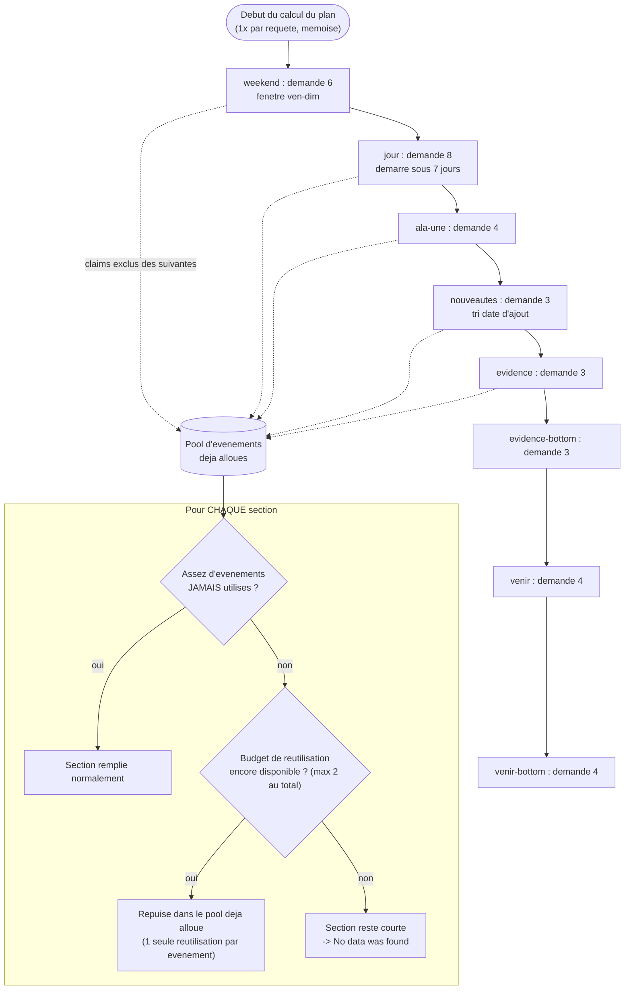
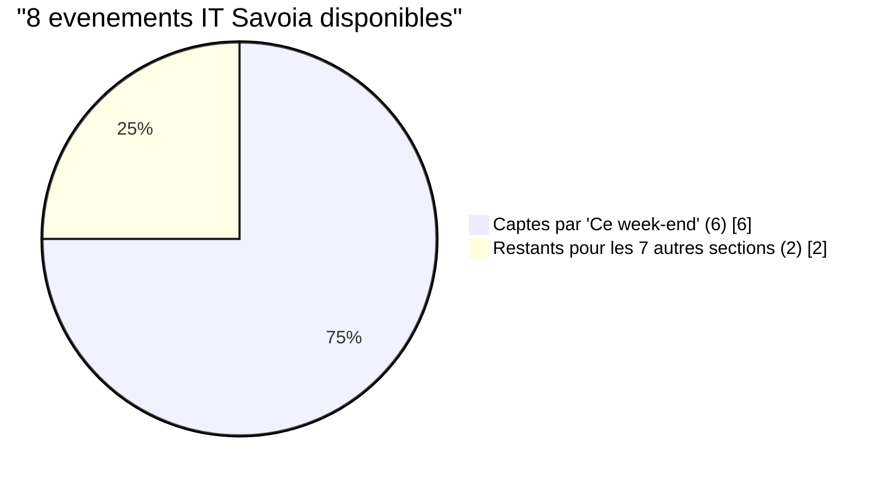

# Agenda Sabauda : règles des pages d'accueil (homepages)

> Document de référence. Décrit **comment fonctionnent les homepages** du site
> agendasabauda.eu : gabarit unifié FR/IT, URLs, filtrage par territoire,
> répartition des événements dans les sections, règles d'affichage responsive,
> images de repli, et les points critiques (là où le manque de contenu source
> fait apparaître des trous). À versionner dans le dépôt GitHub du projet.
>
> Dernière mise à jour du code décrit : 2026-07-25.
>
> Voir aussi `docs/NOMMAGE_TERRITOIRES.md` (convention de nommage des
> territoires/sous-divisions, antérieure à ce document) et
> `docs/SPECS_VISUELS_FALLBACK.md` (spécifications visuelles des images de
> repli, complémentaire du §7 ci-dessous).

---

## 0. Ce qu'on appelle « une homepage »

Une seule page de contenu réel existe : **la page 928 (FR, « Accueil »)**. Tout
le reste est dérivé de cette page à l'affichage :

- **Version italienne** : page 1717 (« Home IT »), traduction Polylang de 928.
  Son contenu n'est **pas** édité séparément : il est régénéré automatiquement à
  partir de 928 par un dictionnaire de traduction (voir §2).
- **Versions filtrées par territoire** : la même page 928 (ou 1717) affichée
  avec un paramètre de territoire, qui restreint les événements à un seul des 4
  territoires (voir §4).

Il n'existe donc **jamais** 5 pages FR + 5 pages IT à maintenir. Il y a
**1 gabarit**, décliné par langue et par territoire de façon programmatique.

Les 4 territoires (avec leurs identifiants de terme de taxonomie `territoire`) :

| Clé interne | Slug FR | Slug IT | Terme FR | Terme IT | Nom FR | Nom IT |
|---|---|---|---|---|---|---|
| `savoie` | `savoie` | `savoia` | 3 | 318 | Savoie | Savoia |
| `piemont` | `piemont` | `piemonte` | 6 | 321 | Piémont | Piemonte |
| `vda` | `vallee-d-aoste` | `valle-d-aosta` | 8 | 324 | Vallée d'Aoste | Valle d'Aosta |
| `nice` | `comte-de-nice` | `contea-di-nizza` | 10 | 327 | Comté de Nice | Contea di Nizza |

Source de vérité de cette table : `cs_terr_canon_data()` dans le mu-plugin
`cs-territoire-persistant.php`. Toute règle qui touche à un territoire doit
passer par cette fonction, jamais par des identifiants codés en dur ailleurs.

### Schéma d'ensemble des dépendances

---

## 1. Comment la homepage est rendue (pipeline)

- **Snippet 29 « CS · Gabarit Accueil (928) »** intercepte les pages 928 et 1717
  via `template_redirect`, puis fait `get_header()` + rendu du contenu +
  `get_footer()` + `exit`. Cela court-circuite le gabarit `page.php` du thème.
- **Conséquence critique** : le rendu se fait **hors de La Boucle WordPress**.
  Donc `in_the_loop()` et `is_main_query()` sont **toujours faux** sur ces pages.
  Un filtre `the_content` visant la home ne doit **jamais** se garder avec ces
  fonctions (il ne s'exécuterait jamais). Se garder uniquement sur `is_page()`.
- **Ne jamais ouvrir la page 928 dans l'éditeur Elementor**, même sans
  sauvegarder : cela pose `_elementor_edit_mode = builder` en postmeta et casse
  le rendu (la page n'a jamais été construite avec Elementor).

Le préfixe des tables de cette base est **`wor4956_`**, pas `wp_`. Toute requête
SQL directe doit utiliser `$wpdb->prefix`.

---

## 2. Version italienne : traduction automatique (pas de double saisie)

- **Snippet 71 « CS - Gabarit Accueil unifie FR-IT »** : un filtre `the_content`
  qui, **uniquement sur la page 1717**, récupère le contenu brut de la page 928
  et applique un dictionnaire de traduction (`cs_home_lb_map()`,
  environ 70 paires FR vers IT) par `str_replace`.
- La page 1717 n'a donc **aucun contenu propre à maintenir** : on édite 928, l'IT
  suit.
- **Limite connue** : quelques libellés d'interface peuvent rester en français
  sur l'IT si leur chaîne exacte n'est pas dans le dictionnaire. Correction =
  ajouter la paire manquante dans `cs_home_lb_map()`.

---

## 3. URLs des homepages

Format propre, mis en place le 2026-07-23 (mu-plugin `cs-territoire-urls-jolies.php`) :

| Usage | URL FR | URL IT |
|---|---|---|
| Home globale (4 territoires) | `/` | `/it/` |
| Home filtrée sur un territoire | `/explore/<slug-fr>/` | `/it/scopri/<slug-it>/` |
| Écran de choix de langue (Piémont / Vallée d'Aoste) | `/choisir/<slug-fr>/` | (sans objet) |

Exemples : `/explore/savoie/`, `/it/scopri/piemonte/`, `/choisir/piemont/`.

Détails techniques :

- Ces chemins sont des règles de réécriture qui injectent en interne
  `$_GET['as_territoire']` (ou `$_GET['choix_territoire']`) très tôt
  (`parse_request`), pour que toute la logique existante fonctionne sans le savoir.
- Les **anciennes URLs** `/?as_territoire=X` et `/?choix_territoire=X`
  **continuent de fonctionner** (rien n'est retiré : aucun lien externe ne casse).
- `/?as_territoire=tous` (FR) et `/?as_territoire=tutti` (IT) servent à
  **effacer** le cookie de territoire (retour à la vue 4 territoires). Ce lien
  précis reste volontairement sous l'ancienne forme.
- WordPress veut rediriger canoniquement `/explore/x/` vers `/` (car 928 est la
  page d'accueil statique) : c'est désamorcé pour ces routes via
  `remove_action('template_redirect', 'redirect_canonical')`.

---

## 4. Filtrage par territoire

Trois mu-plugins collaborent (par convention du site : nouveau comportement =
nouveau fichier, on ne modifie pas les précédents) :

1. **`cs-home-territoire-filtre.php`** : lit `$_GET['as_territoire']`, valide
   contre les slugs des 4 territoires (FR et IT), ajoute un `tax_query` territoire
   aux requêtes Query Builder [14..21].
2. **`cs-home-territoire-choix-langue.php`** : gère l'écran interstitiel de choix
   de langue pour Piémont / Vallée d'Aoste (territoires bilingues), et le libellé
   dynamique « Vous regardez X » / « Stai guardando X ».
3. **`cs-territoire-persistant.php`** : pose un **cookie `as_territoire`
   (30 jours)** à chaque clic sur un territoire, filtre les sections home par ce
   cookie quand aucun paramètre n'est dans l'URL, régénère dynamiquement les
   listes du sélecteur de territoire (barre « Changer : » + dropdown mobile), et
   gère le bandeau territoire site-wide.

Priorité du territoire actif (fonction `cs_territoire_actif()`) :
**paramètre GET d'abord, cookie ensuite**. Sur une page lieu (hub ville) ou une
fiche événement, c'est le territoire de la page qui prime, pas le cookie.

---

## 5. Sections de la home et répartition des événements

### 5.1 Les sections

| Section (`_element_id`) | Titre affiché FR | Listing JetEngine | Taille demandée à l'allocateur |
|---|---|---|---|
| `ala-une` | À la une | 1695 (desktop) / 1696 (mobile) | 4 |
| `weekend` | Ce week-end | 1695 | 6 |
| `jour` | Les 7 prochains jours | 1696 | 8 |
| `nouveautes` | Nouveautés sur Agenda Sabauda | 1690 | 3 |
| `evidence` | En évidence | 1688 | 3 |
| `evidence-bottom` | En évidence (bas) | 1688 | 3 |
| `venir` | L'agenda à venir | 1690 | 4 |
| `venir-bottom` | L'agenda à venir (bas) | 1690 | 4 |

En plus, hors allocateur : un **carrousel « Sélections »** (Query Builder 4) et la
section **« Ça vaut le déplacement »** (Query Builder 22 FR / 23 IT), qui montre
volontairement l'autre versant (jamais le territoire où l'on est déjà).

### 5.2 L'allocateur unifié (snippet 44 « CS · Anti-doublon home »)

C'est **la** pièce centrale. Au premier rendu de grille, il calcule **une fois**
un plan complet qui attribue à chaque section une tranche d'événements. Chaque
grille reçoit ensuite sa tranche via `post__in`. Déterministe, indépendant de
l'ordre de rendu et du mécanisme interne de JetEngine.

Règles appliquées par l'allocateur :

- **Langue** : uniquement les événements de la langue courante (Polylang).
- **Territoire** : si un territoire est actif (cookie ou GET), on restreint à ce
  territoire (terme FR ou IT selon la langue).
- **Fenêtres de dates** :
  - `weekend` = événements chevauchant le week-end à venir (vendredi 00:00 au
    dimanche 23:59).
  - `jour` (« Les 7 prochains jours ») = événements dont la date de **début**
    tombe dans les 7 prochains jours (d'aujourd'hui à J+7).
  - `ala-une`, `nouveautes`, `evidence`, `venir` = événements à venir (fin ≥
    maintenant). `nouveautes` est trié par date d'ajout décroissante (les plus
    récemment publiés).
- **Ordre de réservation (priorité)** : weekend → jour → ala-une → nouveautes →
  evidence → evidence-bottom → venir → venir-bottom. Un événement réservé par
  une section n'est en principe plus disponible pour les suivantes.
- **Exclusivité avec flexibilité restreinte** (règle métier explicite) :
  - Par défaut chaque section prend des événements **jamais utilisés ailleurs**.
  - Si une section manque de contenu, elle peut **repuiser** dans les événements
    déjà attribués, MAIS : un événement ne peut être **réutilisé qu'une seule
    fois** (jamais dans une 3e section), ET au total sur toute la home **au
    maximum 2 événements distincts** sont ainsi répétés (`reuse_budget = 2`).
  - Au-delà de ce budget, une section qui manque de contenu **reste courte** :
    « No data was found » reste alors un **signal fiable** de vraie pénurie,
    jamais masqué artificiellement.
- **Lignes complètes** (`cs_home_row_size`) : seule **`jour`** est arrondie à un
  multiple de son pas (4) — **y compris vers 0** si le stock est inférieur à une
  ligne complète. C'est ce qui produit le comportement « 4 ou 8 » de la section
  « 7 prochains jours » (jamais 5, 6 ou 7 ; jamais au-delà de 8) : ici, la règle
  métier explicite (jamais de nombre intermédiaire) justifie l'arrondi à 0.
  Vérifié sur les 10 variantes de home (5 FR + 5 IT) : `jour` toujours ∈
  {0, 4, 8}.
- **⚠️ Bug trouvé et corrigé le 2026-07-25 : `ala-une` et `weekend` avaient le
  même arrondi-à-zéro, à tort.** Contrairement à `jour`, ni « à la une »
  (règle : 3 fixe desktop / 4 mobile) ni « ce week-end » n'ont de règle métier
  imposant un multiple — ce n'était qu'une extrapolation du principe de `jour`,
  appliquée sans nécessité. Conséquence réelle observée : sur IT Savoia, 2
  événements jamais utilisés ailleurs existaient pour « à la une » mais étaient
  arrondis à 0 (floor(2/4)×4 = 0), affichant « No data was found » alors que du
  contenu réel existait ; pire, la section « jour » avait quand même consommé
  le budget de réutilisation en tentant de compenser son propre manque, pour un
  résultat lui aussi arrondi à 0 — double perte. Corrigé : `cs_home_row_size`
  ne force plus de multiple que pour `jour`. Le plafond d'affichage (3 desktop
  / 4 mobile pour `ala-une`) reste géré uniquement par le CSS `nth-child`
  (snippet 77), indépendamment de l'allocateur. Vérifié après correction :
  IT Savoia « à la une » passe de 0 à 3 items affichés.

### Ordre de priorité et logique de réservation

**Lecture du schéma** : chaque section essaie d'abord des événements neufs. Si
elle en manque et qu'il reste du budget de réutilisation (2 événements distincts
maximum, toutes sections confondues), elle peut reprendre un événement déjà
utilisé ailleurs — mais jamais un même événement plus de 2 fois au total. Au-delà,
« No data was found » est un signal honnête de pénurie réelle.

---

## 6. Règles d'affichage responsive

**Seuil mobile / desktop du site : 900px** (abaissé de 1024px à 900px le
2026-07-24, dans le snippet 12 et le snippet 62). En dessous de 900px = version
mobile ; à partir de 900px = version desktop.

Comptes d'événements affichés par section (indépendamment de ce que fournit
l'allocateur, plafonné par CSS dans le snippet 77) :

| Section | Mobile | Desktop |
|---|---|---|
| À la une (`ala-une`) | 4 (grille 2 colonnes, 2 lignes) | 3 (1 ligne de 3) |
| Les 7 prochains jours (`jour`) | 4 | 4 ou 8 (jamais 5/6/7, jamais > 8) |

Autres règles d'affichage (snippet 77) :

- La section **3 colonnes** (Nouveautés / En évidence / L'agenda à venir) est
  affichée partout (desktop **et** mobile). Sur mobile elle passe en **1 colonne**
  (empilée), pas en 3 colonnes serrées.
- On **ne cache plus les colonnes vides** : une colonne sans résultat affiche
  « No data was found » au lieu de disparaître (signal de pénurie assumé).
- Le **rail « jour » mobile** (bande compacte) ne s'affiche **que sur mobile** ;
  il est masqué sur desktop.
- Le **mini-carrousel mobile** (bloc `.as-home`) ne s'affiche **que sur mobile**
  (masqué à partir de 900px). C'est normal : il n'a pas d'équivalent desktop.

```mermaid
graph LR
  subgraph M["< 900px : MOBILE"]
    M1["as-home visible<br/>(carrousel + rails)"]
    M2["as-home-desktop cache"]
    M3["ala-une : 4 items<br/>grille 2 colonnes"]
    M4["jour : 4 items max<br/>(nth-child cap)"]
    M5["3-colonnes : 1 colonne empilee"]
  end
  subgraph D["≥ 900px : DESKTOP"]
    D1["as-home cache"]
    D2["as-home-desktop visible"]
    D3["ala-une : 3 items<br/>(posts_num du bloc)"]
    D4["jour : 4 ou 8 items<br/>(row_size allocateur)"]
    D5["3-colonnes : grille 1.5fr/1fr/1fr"]
  end
  M -->|"resize >= 900px"| D
  D -->|"resize < 900px"| M
```

---

## 7. Images de repli (fallback)

Quand un événement n'a **pas** de vraie image mise en avant, on affiche une
illustration de repli au lieu du texte « Visuel » ou d'un vide.

- **48 images** existent : 4 territoires × 12 catégories.
- Convention de nommage (slug d'attachement) :
  `fallback-<slug-territoire-fr>-<slug-categorie-fr>`.
  Exemple : `fallback-piemont-concerts-musique`.
- Le repli s'applique **partout automatiquement** (home comprise) : le snippet 87
  fait qu'un événement sans `_thumbnail_id` renvoie l'identifiant du JPEG de repli
  territoire × catégorie comme s'il s'agissait du thumbnail réel. Tout code
  standard (blocs JetEngine, Yoast, etc.) en bénéficie sans modification.
- Repli ultime si le fichier n'existe pas : un aplat de couleur par territoire +
  monogramme (dans `cs_fallback_visual()`, snippet 21).
- Voir `docs/SPECS_VISUELS_FALLBACK.md` pour les spécifications visuelles
  détaillées (palette, style d'illustration) de ces images.

Chantier futur : garantir une **vraie photo par événement** à la source, pour
réduire le recours au repli.

---

## 8. Dates : événement long déjà en cours

Pour un événement long déjà commencé (ex. « du 1er avril au 31 octobre » consulté
en juillet) :

- **Texte affiché** (fiche événement, snippet 56 ; cartes, `cs_event_date_short`
  snippet 21) : « Jusqu'au {fin} » (FR) / « Fino al {fin} » (IT), au lieu de « du
  {début} au {fin} » qui laisse croire à tort que c'est fini ou pas commencé.
- **Lien « Ajouter à mon agenda »** (snippet 69, Google / Outlook / .ics) :
  l'entrée créée démarre à **aujourd'hui** (jour du clic), pas à la date de début
  réelle passée. Fonction `cs_atc_effective_start()`.

---

## 9. Instagram par territoire

- Snippet 88 : un lien Instagram par territoire (`cs_instagram_territoire_map()`).
- Aujourd'hui **seul le compte Savoie existe**
  (`instagram.com/agendasabauda.savoie`). Les 3 autres n'existent pas encore.
- **Comportement live (depuis le 2026-07-24, changé sur demande explicite)** :
  le bouton Instagram ne s'affiche **que** pour `territoire = savoie` **ET**
  `langue = fr`. Dans tous les autres cas (Piémont, VdA, Nice, ou Savoie en IT),
  la fonction `cs_instagram_account()` renvoie `null` et le bouton est **retiré
  entièrement** (pas de repli vers le compte Savoie, pas de bouton mort).
- Ce choix évite d'afficher un compte Savoie sous un autre territoire (ce que
  faisait l'ancien repli, source de confusion). Pour activer un territoire, il
  suffira d'ajouter son URL réelle dans `cs_instagram_territoire_map()` : le code
  le branchera automatiquement, sans autre modification.

---

## 10. Points critiques et limites connues

**Le facteur limitant n'est pas le code, c'est le volume de contenu source**,
surtout les traductions italiennes.

- Sur les petits territoires en **italien**, il y a très peu d'événements
  traduits. Exemple mesuré (2026-07-24) : seulement **8 événements IT pour la
  Savoie**, dont **6 captés par « Ce week-end »** (ils tombent légitimement dans
  la fenêtre vendredi-dimanche). Il ne reste alors que 2 événements pour alimenter
  les 7 autres sections, d'où des « No data was found » en cascade dès que le
  budget de réutilisation (2) est épuisé.
- La section **« Les 7 prochains jours »** dépend de la date de **début** : un
  territoire peut avoir beaucoup d'événements futurs mais très peu qui *démarrent*
  dans les 7 jours. Exemple : Savoie FR avait 39 événements futurs mais **1 seul**
  démarrant dans les 7 jours.
- « No data was found » est donc **voulu comme signal** : il pointe une vraie
  pénurie (pas assez d'événements, ou pas assez de traductions IT), pas un bug.

**Exemple mesuré : IT Savoia (2026-07-24)**

Ces 2 restants alimentent `ala-une` et `nouveautes` (via réutilisation, budget de
2 épuisé) ; `jour`, `evidence`, `evidence-bottom`, `venir`, `venir-bottom`
affichent alors « No data was found ». Aucun bug : c'est l'arithmétique de la
pénurie de traductions IT.

Leviers possibles si on veut réduire les trous (à décider, non appliqués) :

- Augmenter le nombre d'événements traduits en IT (action éditoriale).
- Revoir la priorité de « Ce week-end » (qui rafle le plus gros morceau en
  premier sur les petits pools).

**Fait le 2026-07-25** : le message « No data was found » (défaut JetEngine,
affiché en anglais dans les sections vides, y compris en FR/IT) est désormais
**traduit** — « Aucun événement pour le moment » (FR) / « Nessun evento al
momento » (IT), via un filtre `gettext` (snippet 98) qui lit la langue Polylang
courante. La section vide reste affichée (signal de pénurie assumé), mais dans
la bonne langue.

---

## 11bis. Nommage des pages WordPress — règle et constat critique

> **Pour le lecteur non-dev** : dans WordPress, une « page » a deux noms
> différents. Le **titre** est ce qu'on voit dans le navigateur et sur Google
> (ex. « Accueil »). Le **slug** est le petit morceau d'URL (ex. `accueil` dans
> `agendasabauda.eu/accueil`). Le problème décrit ci-dessous, c'est qu'aucun des
> deux ne dit si une page est « la vraie source à éditer » ou « une copie
> automatique à ne jamais toucher ».
>
> Voir aussi `docs/NOMMAGE_TERRITOIRES.md` pour la convention de nommage des
> **territoires eux-mêmes** (Savoie/Piémont/Vallée d'Aoste/Comté de Nice, leurs
> sous-divisions, exonymes) — ce §11bis ne couvre que le nommage **des pages
> WordPress**, un sujet différent mais lié.

### Constat (le problème est réel, pas théorique)

Rien dans le titre ni dans le slug d'une page n'indique aujourd'hui :

- si c'est une page **SOURCE** (on l'édite directement, ex. page 928) ;
- si c'est une page **DÉRIVÉE** (générée automatiquement à partir d'une autre,
  ex. page 1717 — l'éditer directement ne sert à rien, tout est écrasé au
  prochain affichage) ;
- si c'est une page de **test/gabarit** technique, pas destinée aux visiteurs
  (ex. page 3380 « TEST gabarit home unifie », restée publiée par oubli).

**Ça a déjà causé un bug concret** : la page 1842 s'appelle « Ce week-end en
Piémont » mais son **slug est juste `piemont`**. En créant l'URL propre
`/explore/piemont/` (§3), il a fallu contourner cette collision. Il existe aussi
une page 2859 titrée simplement « Piémont » (slug différent) — deux pages
plausibles pour « la page Piémont ».

### Pourquoi on ne renomme pas simplement le titre

Le **titre est public** : il s'affiche dans l'onglet du navigateur et dans les
résultats Google (vérifié : la balise `<title>` de la home est exactement
« Accueil - Agenda Sabauda »). Y mettre du jargon interne (« [GABARIT] »,
« NE PAS ÉDITER ») dégraderait le référencement et l'expérience visiteur. Ce
n'est pas la bonne solution.

### La règle adoptée

1. **Colonne « Rôle (interne) »** dans `wp-admin → Pages` (snippet 93, portée
   `admin` uniquement — **jamais chargée côté public**, zéro risque SEO). Elle
   affiche en clair, pour les pages qui le nécessitent : `SOURCE`, `DÉRIVÉE —
   ne pas éditer`, ou `TEST — à supprimer/dépublier`. À compléter dans
   `cs_page_roles()` (snippet 93) à chaque nouvelle page de ce type.
2. **Règle de nommage des slugs pour toute future page gabarit/technique** :
   préfixe `gabarit-` (ex. `gabarit-hub-territoire`) ou `test-` pour une page de
   test. Un slug ne doit **jamais** être plus générique que ce que son titre
   suggère (la leçon de la page 1842).
3. **Titre et slug ne doivent jamais se contredire.** Si le titre change de
   sujet, le slug doit suivre (avec une redirection si la page est déjà
   indexée).

### Nettoyage effectué (2026-07-24)

- **Page 3380** (« TEST gabarit home unifie ») : supprimée définitivement
  (contenu vide, plus aucune utilité).
- **8 pages « Ce week-end en X » legacy** (IDs 1840-1847, un ancien système
  antérieur aux hubs territoire actuels, contenu vide) : conservées mais
  **renommées** vers des slugs canoniques et **redirigées en 301** vers leur
  équivalent réel dans le système de hubs actuel — aucun contenu perdu, aucun
  lien externe cassé, plus de page vide visible.

  | Page | Nouveau slug | Redirige vers |
  |---|---|---|
  | 1840 (FR Savoie) | `savoie-dept73` | `/que-faire-en-savoie/ce-week-end/` |
  | 1841 (IT Savoia) | `savoia-dept73` | `/it/cosa-fare-in-savoia/questo-weekend/` |
  | 1842 (FR Piémont) | `piemont` *(inchangé)* | `/que-faire-dans-le-piemont/ce-week-end/` |
  | 1843 (IT Piemonte) | `piemonte` *(inchangé)* | `/it/cosa-fare-in-piemonte/questo-weekend/` |
  | 1844 (FR Vallée d'Aoste) | `vallee-d-aoste` *(inchangé)* | `/que-faire-en-vallee-d-aoste/ce-week-end/` |
  | 1845 (IT Valle d'Aosta) | `valle-d-aosta` *(inchangé)* | `/it/cosa-fare-in-valle-d-aosta/questo-weekend/` |
  | 1846 (FR Nice) | `comte-de-nice` | `/que-faire-dans-le-comte-de-nice/ce-week-end/` |
  | 1847 (IT Nizza) | `contea-di-nizza` | `/it/cosa-fare-nella-contea-di-nizza/questo-weekend/` |

  Mécanisme : mu-plugin `cs-redirect-weekend-legacy.php` (`template_redirect`,
  priorité 5, `wp_redirect(..., 301)`). Distinct de `cs-redirections-301.php`
  (déjà existant, gère les slugs de **taxonomie** territoire, pas ces pages).

  **Note sur `dept73`** : le département français « Savoie » porte le numéro
  73 (à distinguer de « Haute-Savoie », département 74) — décision explicite de
  Franck, le suffixe `-dept<numéro>` (pas « département » en toutes lettres)
  est la convention retenue quand une précision de département est utile.
  Cohérent avec `docs/NOMMAGE_TERRITOIRES.md` §2, qui accepte la forme
  « Savoie (dept. 73) ».

- **Page 1703** : titre renommé de « Newsletter » vers « S'inscrire à la
  newsletter » (cohérent avec l'équivalent IT « Iscriviti alla newsletter »).
  Slug inchangé (`/newsletter/`), aucune redirection nécessaire.

---

## 11. Inventaire des snippets et mu-plugins (rôle sur la home)

**Code Snippets** (tous actifs) :

| ID | Nom | Rôle home |
|---|---|---|
| 12 | CS · Composants (styles) | CSS global (breakpoint 900px, grilles). CSS encodé en **base64**. |
| 21 | CS · Composants carte (partagé) | Cartes, `cs_event_date_short`, `cs_fallback_visual`. |
| 29 | CS · Gabarit Accueil (928) | Rendu de la home (template_redirect, hors Boucle). |
| 44 | CS · Anti-doublon home | **Allocateur** des sections (voir §5.2). |
| 56 | CS · Gabarit Fiche Événement | Fiche événement (texte de date « Jusqu'au »). |
| 62 | CS · Header compact (scroll) | Header sticky + breakpoint 900px. |
| 69 | CS — Ajouter à mon agenda | Boutons agenda perso (date effective). |
| 71 | CS - Gabarit Accueil unifie FR-IT | Traduction auto FR vers IT sur page 1717. |
| 77 | CS - Ne pas cacher colonnes vides | Règles d'affichage responsive (caps, colonnes, lignes complètes). |
| 87 | CS - Fallback visuel = thumbnail | Repli image partout. |
| 88 | CS - Instagram par territoire | Lien Instagram adapté au territoire. |
| 93 | CS - Colonne role pages (admin) | Colonne « Rôle » dans wp-admin → Pages (§11bis), scope `admin` seul. |
| 98 | CS - Traduire No data was found (JetEngine FR/IT) | Filtre `gettext` traduisant le message de grille vide selon la langue Polylang (§10). |

**mu-plugins** :

| Fichier | Rôle |
|---|---|
| `cs-home-territoire-filtre.php` | Filtre territoire (GET) sur requêtes 14-21. |
| `cs-home-territoire-choix-langue.php` | Écran de choix de langue Piémont/VdA + libellé actif. |
| `cs-territoire-persistant.php` | Cookie territoire, sélecteur dynamique, bandeau site-wide, `cs_terr_canon_data()`. |
| `cs-territoire-urls-jolies.php` | URLs `/explore/`, `/it/scopri/`, `/choisir/`. |
| `cs-query-ce-week-end-dates.php` | Fenêtres de dates des requêtes Query Builder. |
| `cs-redirections-301.php` | Redirections des anciens slugs de **taxonomie** territoire (préexistant). |
| `cs-redirect-weekend-legacy.php` | Redirections des 8 anciennes **pages** « Ce week-end en X » (§11bis). |

---

## 12. À ne jamais faire (pièges vérifiés)

- Ne pas coder en dur `wp_posts` / `wp_snippets` : le préfixe est **`wor4956_`**
  (une requête en erreur renvoie `NULL`, ce qui se lit à tort comme « absent »).
- Ne pas garder un filtre `the_content` home avec `in_the_loop()` /
  `is_main_query()` (toujours faux ici, le filtre ne tournerait jamais).
- Ne pas ouvrir la page 928 dans Elementor (casse le rendu via
  `_elementor_edit_mode`).
- Ne jamais employer le tiret cadratin « — » dans les contenus publiés.
- Toujours valider un snippet PHP (`eval('if(0){ CODE }')`) avant de l'écrire en
  base (historique de panne du site).
