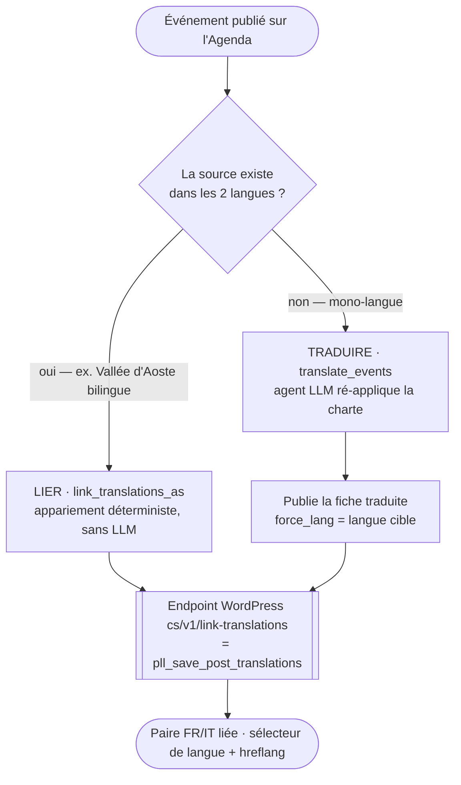
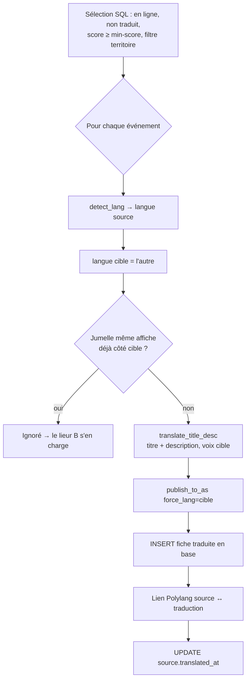

# La traduction — comment le site devient bilingue FR ↔ IT

*État des lieux du pipeline de traduction de Cultura Sabauda / Agenda Sabauda (26 juillet 2026). Décrit le système RÉEL (tel qu'il est codé), avec schémas. Document de travail — à relire et amender.*

---

## 1. Le principe

Agenda Sabauda est un **site bilingue** (Polylang, FR + IT). Le but : qu'un **événement savoyard soit visible côté italien**, qu'un **événement piémontais soit visible côté français**, et que les **newsletters des deux versants** aient de la matière.

Il y a **deux façons** d'obtenir une paire FR/IT liée — et le système fait les deux :

1. **TRADUIRE** (`translate_events.py`) — la source n'existe que dans une langue → on **produit** la version dans l'autre langue (agent LLM) et on crée la fiche jumelle.
2. **LIER** (`link_translations_as.py`) — la source publie **déjà** l'événement dans les deux langues (fréquent en Vallée d'Aoste, bilingue) → on ne traduit rien, on **relie** les deux fiches existantes comme traductions Polylang.

Dans les deux cas, le résultat est une **paire liée** : sélecteur de langue, archives par langue et `hreflang` fonctionnent.

---

## 2. Mécanisme A — TRADUIRE (`scripts/translate_events.py`)

### Sens
**FR → IT** ou **IT → FR**, selon la **langue détectée** de l'événement source (`utils.lang.detect_lang`, §4).

### Périmètre (volontairement resserré — coût API + qualité)
On ne traduit qu'un événement qui est :
- **déjà en ligne** sur l'Agenda (`wp_post_id_as` renseigné) ;
- **non-doublon** (`duplicate_of IS NULL`), **pas déjà une traduction**, **pas déjà traduit** (`translated_at` vide) ;
- de **score utile** (`--min-score`, défaut **6** ; prend `user_score` sinon `llm_score`) ;
- **sans jumelle déjà présente** dans la langue cible : si un événement partageant la **même affiche** existe déjà côté cible, c'est le même événement bilingue → on **laisse le lieur** (mécanisme B) faire le lien, on ne re-traduit pas.

### Ce qu'on traduit — et ce qu'on ne traduit pas
On traduit **le TITRE + la DESCRIPTION**. La fiche traduite est bâtie sur la **description traduite** — **l'article enrichi FR (`article_md`) n'est PAS recopié ni traduit** (les champs `article_*`, `enrich_data`, `seo_*` repartent vides côté cible). *(Voir §9 : c'est un choix à interroger — la version cible est éditorialement plus légère que la source enrichie.)*

Les **FAITS ne changent pas** de langue : dates, programme, line-up, lieu, horaires, tarifs, chiffres restent **identiques**. Seule l'**expression** est réécrite ; un programme/une liste se traduit **ligne à ligne**.

### La règle mère : traduire n'est pas recopier
La version cible obéit à la **MÊME charte** que la source. L'agent **ré-applique** la charte, il ne translittère pas un défaut : si le titre source est racoleur, TOUT EN CAPITALES, truffé de superlatifs creux ou de dark patterns, il est **corrigé** dans la version cible. *Une mauvaise source ne doit pas produire une mauvaise traduction.*

### Publication + liaison
La fiche traduite est publiée via `publish_to_as` avec **`force_lang`** (langue cible imposée) + `force_create`, enregistrée en base (`translation_of`, `translated_lang`, `url_source` = pseudo-lien `translated:{id}:{lang}`), puis **liée** à la source via l'endpoint Polylang. La source est marquée `translated_at`.

**Sécurité** : `--dry-run` **par défaut** (simulation, rien n'est écrit) ; `--apply` pour agir ; `--cap` (défaut 10) pour de petits lots ; `--territoire` pour remplir un versant maigre (ex. `--territoire piemont` traduit les événements piémontais IT → FR).

---

## 3. Mécanisme B — LIER les jumelles existantes (`scripts/link_translations_as.py`)

Beaucoup de sources (Vallée d'Aoste, transfrontalier) publient le **même événement en FR ET IT**. Le dédup (`dedupe.py`) reste **mono-langue** — il ne les fusionne pas. Ce sont **deux fiches à relier** comme traductions Polylang.

**Appariement CONSERVATEUR (aucun LLM)** : deux événements déjà publiés sur l'Agenda forment une paire s'ils sont
- dans le **même territoire**,
- de **langue différente** (`utils.lang`),
- fortement liés par le **contenu** : **même image source** (signal le plus fort — les versions FR/IT partagent l'affiche), **OU** titres « même histoire » (noms propres partagés) **ET** même date de début.

Le liage passe par le même endpoint `cs/v1/link-translations`. **Dry-run par défaut**, `--apply` pour exécuter.

---

## 4. La détection de langue (`utils/lang.py → detect_lang`)

Renvoie `'fr'` ou `'it'`, sans LLM (déterministe, mots-outils + marqueurs orthographiques) :

1. **Le TITRE prime** (pesé ×3) : une marge nette dans le seul titre tranche (protège d'une description bilingue collée à un titre d'une autre langue).
2. Sinon, **titre + description** combinés (titre ×3).
3. Texte indécis → le **territoire** départage (Savoie→fr, Piémont→it, Vallée d'Aoste neutre…).
4. Dernier recours → `'fr'` (langue du site).

---

## 5. La voix en italien (dans `translate_title_desc`)

La traduction n'est pas neutre : elle applique une **voix IT** propre, en miroir de la voix FR.

| Dimension | Français | Italien |
|---|---|---|
| **Boussole** | *Internazionale* / *Le Monde Diplo* | *Internazionale* (pas de calque du français) |
| **Toponymes** | Turin, Aoste, Nice, Verceil ; Savoie, Piémont, Vallée d'Aoste, Comté de Nice | **Torino** (pas « Turin »), Aosta, **Nizza**, Vercelli ; **Savoia, Piemonte, Valle d'Aosta, Contea di Nizza** |
| **Superlatifs creux interdits** | incontournable, magique, à ne pas manquer, événement phare | imperdibile, da non perdere, evento clou, magico, unico/straordinario, il migliore |
| **Dark patterns interdits** | « plus que 2 places ! », « dernier jour », clickbait, confirmshaming | « ultimi posti! », « solo oggi », « affrettati », « non crederai… », confirmshaming |
| **Casse** | mois/jours en minuscule ; jamais de Title Case anglais | mois/jours en minuscule (« 5 luglio », « domenica ») ; jamais de Title Case |

**Toujours** : casse de phrase (jamais TOUT EN CAPITALES, même si la source l'écrit ainsi → « COREOGRAFIE DEL POSSIBILE » devient « Coreografie del Possibile ») ; on **préserve** les vrais sigles (FIAF, MAO, ONU), la casse d'une marque (iMac), et les **noms propres réels** (on n'invente pas d'exonyme pour une ville qui n'en a pas).

---

## 6. Qui fait quoi (scripts & modules)

- **`scripts/translate_events.py`** — le traducteur actif (mécanisme A) : sélection, détection langue, dédup jumelle, `translate_title_desc` (agent), publication `force_lang`, liaison, marquage.
- **`scripts/link_translations_as.py`** — le lieur déterministe (mécanisme B) : apparie et relie les jumelles déjà bilingues, sans LLM.
- **`utils/lang.py`** — `detect_lang` (FR/IT) + langue par territoire.
- **`scripts/publisher_as.py`** — publie la fiche cible avec `force_lang` (Polylang) ; `_lang()` détermine la langue à la publication normale.
- **`scripts/repair_translation.py`** — répare des liaisons/traductions cassées.
- **`scripts/diagnose_italien.py`** — diagnostique l'état du **versant italien** (couverture, trous).

---

## 7. Où ça se déclenche (câblage)

- **Cron quotidien** — « Pipeline complet, tous les jours 6h05 » : collecte → éval → visuels → **enrichissement (rédaction FR)** → autocomplete (publication) → **traduction IT**. La traduction tourne donc **en fin de pipeline**, une fois les fiches publiées.
- **Manuel (VPS)** — `python -m scripts.translate_events …` (simulation, puis `--apply`), utile pour **remplir un versant maigre** par territoire.
- Les **fiches traduites** ne se complètent jamais à la main (leur `url_source` est un pseudo-lien `translated:…`) : l'app les exclut des files « À compléter ».

---

## 8. Garde-fous & réglages

- **Dry-run par défaut** (A et B) : on **voit** les paires/traductions avant d'écrire.
- `--min-score` (défaut 6), `--cap` (défaut 10), `--territoire` (cibler un versant).
- `ANTHROPIC_MODEL_TRANSLATE` (défaut **Haiku** — tâche de reformulation cadrée, pas de recherche).
- Dédup **jumelle** (même affiche) : évite de traduire ce qui existe déjà et sera lié.
- Appariement B **conservateur** (image identique, ou noms propres + date) : pas de faux liens.

---

## 9. Points à interroger / pistes (pour tes retours)

1. **La version cible est plus LÉGÈRE que la source.** On traduit la **description**, pas l'**article enrichi** (`article_md`) : côté italien, un événement savoyard n'a donc pas l'article éditorial « escalier » que la version FR a reçu. Est-ce voulu (coût), ou veut-on que la version cible ait, elle aussi, un **article enrichi** (traduire `article_md`, ou ré-enrichir dans la langue cible) ? *C'est le point éditorial le plus important.*
2. **Toponymes & superlatifs IT sont codés en dur** dans `translate_title_desc` — ils recoupent le **lexique sabaud canonique** (Torino/Turin, Contea di Nizza, imperdibile…). Même risque que pour `visual_query` : deux sources de vérité. À terme, faire pointer la voix IT vers le lexique canonique.
3. **La doctrine d'appartenance** (gentilé, jamais la nationalité ; Alpes non-frontière ; « au-delà du Var/Rhône ») n'est **pas encore** rappelée dans le prompt de traduction. Faut-il l'y injecter (comme la charte l'est pour l'enrichissement) pour que la version IT respecte les mêmes interdits ?
4. **Seuil `--min-score 6`** : on ne traduit que le bon score. Élargir pour couvrir davantage le versant maigre, ou garder resserré pour le coût ?
5. **Crédit image** : bien repris sur la fiche traduite (`image_credit` copié) — OK, à confirmer visuellement.
