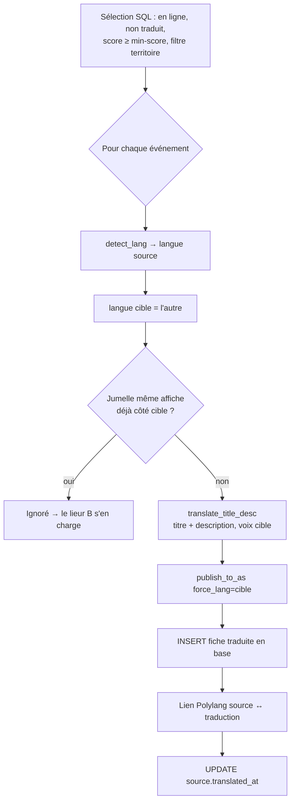

# La traduction — comment le site devient bilingue FR ↔ IT

*État des lieux du pipeline de traduction de Cultura Sabauda / Agenda Sabauda (26 juillet 2026). Décrit le système RÉEL (tel qu'il est codé), avec schémas. Document de travail — à relire et amender.*

---

## 1. Le principe

Agenda Sabauda est un **site bilingue** (Polylang, FR + IT). Le but : qu'un **événement savoyard soit visible côté italien**, qu'un **événement piémontais soit visible côté français**, et que les **newsletters des deux versants** aient de la matière.

Il y a **deux façons** d'obtenir une paire FR/IT liée — et le système fait les deux :

1. **TRADUIRE** (`translate_events.py`) — la source n'existe que dans une langue → on **produit** la version dans l'autre langue (agent LLM) et on crée la fiche jumelle.
2. **LIER** (`link_translations_as.py`) — la source publie **déjà** l'événement dans les deux langues (fréquent en Vallée d'Aoste, bilingue) → on ne traduit rien, on **relie** les deux fiches existantes comme traductions Polylang.

Dans les deux cas, le résultat est une **paire liée** : sélecteur de langue, archives par langue et `hreflang` fonctionnent.

---

## 2. Mécanisme A — TRADUIRE (`scripts/translate_events.py`)

### Sens
**FR → IT** ou **IT → FR**, selon la **langue détectée** de l'événement source (`utils.lang.detect_lang`, §4).

### Périmètre (volontairement resserré — coût API + qualité)
On ne traduit qu'un événement qui est :
- **déjà en ligne** sur l'Agenda (`wp_post_id_as` renseigné) ;
- **non-doublon** (`duplicate_of IS NULL`), **pas déjà une traduction**, **pas déjà traduit** (`translated_at` vide) ;
- de **score utile** (`--min-score`, défaut **6** ; prend `user_score` sinon `llm_score`) ;
- **sans jumelle déjà présente** dans la langue cible : si un événement partageant la **même affiche** existe déjà côté cible, c'est le même événement bilingue → on **laisse le lieur** (mécanisme B) faire le lien, on ne re-traduit pas.

### Ce qu'on traduit — et ce qu'on ne traduit pas
On traduit **le TITRE + la DESCRIPTION**. La fiche traduite est bâtie sur la **description traduite** — **l'article enrichi FR (`article_md`) n'est PAS recopié ni traduit** (les champs `article_*`, `enrich_data`, `seo_*` repartent vides côté cible). *(Voir §9 : c'est un choix à interroger — la version cible est éditorialement plus légère que la source enrichie.)*

Les **FAITS ne changent pas** de langue : dates, programme, line-up, lieu, horaires, tarifs, chiffres restent **identiques**. Seule l'**expression** est réécrite ; un programme/une liste se traduit **ligne à ligne**.

### La règle mère : traduire n'est pas recopier
La version cible obéit à la **MÊME charte** que la source. L'agent **ré-applique** la charte, il ne translittère pas un défaut : si le titre source est racoleur, TOUT EN CAPITALES, truffé de superlatifs creux ou de dark patterns, il est **corrigé** dans la version cible. *Une mauvaise source ne doit pas produire une mauvaise traduction.*

### Publication + liaison
La fiche traduite est publiée via `publish_to_as` avec **`force_lang`** (langue cible imposée) + `force_create`, enregistrée en base (`translation_of`, `translated_lang`, `url_source` = pseudo-lien `translated:{id}:{lang}`), puis **liée** à la source via l'endpoint Polylang. La source est marquée `translated_at`.

**Sécurité** : `--dry-run` **par défaut** (simulation, rien n'est écrit) ; `--apply` pour agir ; `--cap` (défaut 10) pour de petits lots ; `--territoire` pour remplir un versant maigre (ex. `--territoire piemont` traduit les événements piémontais IT → FR).

---

## 3. Mécanisme B — LIER les jumelles existantes (`scripts/link_translations_as.py`)

Beaucoup de sources (Vallée d'Aoste, transfrontalier) publient le **même événement en FR ET IT**. Le dédup (`dedupe.py`) reste **mono-langue** — il ne les fusionne pas. Ce sont **deux fiches à relier** comme traductions Polylang.

**Appariement CONSERVATEUR (aucun LLM)** : deux événements déjà publiés sur l'Agenda forment une paire s'ils sont
- dans le **même territoire**,
- de **langue différente** (`utils.lang`),
- fortement liés par le **contenu** : **même image source** (signal le plus fort — les versions FR/IT partagent l'affiche), **OU** titres « même histoire » (noms propres partagés) **ET** même date de début.

Le liage passe par le même endpoint `cs/v1/link-translations`. **Dry-run par défaut**, `--apply` pour exécuter.

---

## 4. La détection de langue (`utils/lang.py → detect_lang`)

Renvoie `'fr'` ou `'it'`, sans LLM (déterministe, mots-outils + marqueurs orthographiques) :

1. **Le TITRE prime** (pesé ×3) : une marge nette dans le seul titre tranche (protège d'une description bilingue collée à un titre d'une autre langue).
2. Sinon, **titre + description** combinés (titre ×3).
3. Texte indécis → le **territoire** départage (Savoie→fr, Piémont→it, Vallée d'Aoste neutre…).
4. Dernier recours → `'fr'` (langue du site).

---

## 5. La voix en italien (dans `translate_title_desc`)

La traduction n'est pas neutre : elle applique une **voix IT** propre, en miroir de la voix FR.

| Dimension | Français | Italien |
|---|---|---|
| **Boussole** | *Internazionale* / *Le Monde Diplo* | *Internazionale* (pas de calque du français) |
| **Toponymes** | Turin, Aoste, Nice, Verceil ; Savoie, Piémont, Vallée d'Aoste, Comté de Nice | **Torino** (pas « Turin »), Aosta, **Nizza**, Vercelli ; **Savoia, Piemonte, Valle d'Aosta, Contea di Nizza** |
| **Superlatifs creux interdits** | incontournable, magique, à ne pas manquer, événement phare | imperdibile, da non perdere, evento clou, magico, unico/straordinario, il migliore |
| **Dark patterns interdits** | « plus que 2 places ! », « dernier jour », clickbait, confirmshaming | « ultimi posti! », « solo oggi », « affrettati », « non crederai… », confirmshaming |
| **Casse** | mois/jours en minuscule ; jamais de Title Case anglais | mois/jours en minuscule (« 5 luglio », « domenica ») ; jamais de Title Case |

**Toujours** : casse de phrase (jamais TOUT EN CAPITALES, même si la source l'écrit ainsi → « COREOGRAFIE DEL POSSIBILE » devient « Coreografie del Possibile ») ; on **préserve** les vrais sigles (FIAF, MAO, ONU), la casse d'une marque (iMac), et les **noms propres réels**.

### Exonymes : la règle
On **utilise l'exonyme** de la langue du lecteur **quand il existe et est courant** : côté IT → *Torino, Nizza, Aosta, Vercelli* ; côté FR → *Turin, Nice, Aoste, Verceil*. Mais :
- on garde la **chaîne ville → province → territoire** dans la langue cible (*Torino · Piemonte* ; *Nizza · Contea di Nizza*) ;
- on **n'invente jamais** un exonyme pour une ville/un lieu qui n'en a pas de courant (on garde le nom réel) ;
- les **noms propres** (artistes, festivals, œuvres, lieux nommés) restent **tels quels**.

### La symétrie des règles (le vrai enjeu)
Tout l'appareil éditorial appliqué **en français** doit s'appliquer **aussi en italien**, et la traduction doit **re-vérifier** contre lui, pas seulement translittérer :
- **lexique & vocabulaire interdit** (superlatifs creux, dark patterns) — dans leur version **italienne** ;
- **doctrine d'appartenance** — en italien : *savoiardo / piemontese / valdostano / nizzardo*, **jamais** « italiana » ni « francese » comme appartenance ; **jamais** de mots-frontière (`oltralpe`, `transalpino`, `al di là delle Alpi`, `confine`), **jamais** d'irrédentisme (« Nizza italiana », « terre irredente ») ; espace **sabaudo** ;
- **interdits de style IA** (tiret cadratin, gras sur chiffres) — le nettoyage déterministe au rendu s'applique quelle que soit la langue.

⚠️ **Aujourd'hui, rien de tout cela n'est garanti côté IT** : `translate_events` n'injecte pas la voix (voir §9).

---

## 6. Qui fait quoi (scripts & modules)

- **`scripts/translate_events.py`** — le traducteur actif (mécanisme A) : sélection, détection langue, dédup jumelle, `translate_title_desc` (agent), publication `force_lang`, liaison, marquage.
- **`scripts/link_translations_as.py`** — le lieur déterministe (mécanisme B) : apparie et relie les jumelles déjà bilingues, sans LLM.
- **`utils/lang.py`** — `detect_lang` (FR/IT) + langue par territoire.
- **`scripts/publisher_as.py`** — publie la fiche cible avec `force_lang` (Polylang) ; `_lang()` détermine la langue à la publication normale.
- **`scripts/repair_translation.py`** — répare des liaisons/traductions cassées.
- **`scripts/diagnose_italien.py`** — diagnostique l'état du **versant italien** (couverture, trous).

---

## 7. Où ça se déclenche (câblage)

- **Cron quotidien** — « Pipeline complet, tous les jours 6h05 » : collecte → éval → visuels → **enrichissement (rédaction FR)** → autocomplete (publication) → **jumelage FR/IT natif (mécanisme B, gratuit)** → **traduction IT (mécanisme A)**. Le jumelage tourne **avant** la traduction : il lie les paires déjà bilingues à la source et alimente le garde-fou qui empêche `translate_events` de produire une 3e fiche redondante pour un événement qui a déjà une jumelle native. *(Câblé le 28/07/2026 — avant cette date, `link_translations_as` ne tournait jamais automatiquement.)*
- **Manuel (VPS)** — `python -m scripts.translate_events …` (simulation, puis `--apply`), utile pour **remplir un versant maigre** par territoire. `python -m scripts.link_translations_as …` pour relier manuellement à tout moment.
- Les **fiches traduites** ne se complètent jamais à la main (leur `url_source` est un pseudo-lien `translated:…`) : l'app les exclut des files « À compléter ».

---

## 8. Garde-fous & réglages

- **Dry-run par défaut** (A et B) : on **voit** les paires/traductions avant d'écrire.
- `--min-score` (défaut 6), `--cap` (défaut 10), `--territoire` (cibler un versant).
- `ANTHROPIC_MODEL_TRANSLATE` (défaut **Haiku** — tâche de reformulation cadrée, pas de recherche).
- Dédup **jumelle** (même affiche) : évite de traduire ce qui existe déjà et sera lié.
- Appariement B **conservateur** (image identique, ou noms propres + date) : pas de faux liens.

---

## 9. Mes préconisations

**Racine commune de tout ce qui suit :** `translate_events` **ne passe pas par la voix/charte** que `enrich` applique en FR. Il « translittère » avec quelques règles codées en dur, au lieu de **re-vérifier** contre l'appareil éditorial complet en italien. Trois recommandations, par priorité.

### Reco 1 — Injecter la voix dans la traduction *(LE correctif structurant)* — ✅ FAIT (2026-07-26)
`translate_events` charge maintenant la voix (`utils.voix.voix_block()`) et la **préfixe au prompt de traduction**, avec le préambule « la voix prime, tu ré-appliques les règles EN ITALIEN ». La voix — bilingue via le lexique canonique — porte le **vocabulaire interdit**, la **doctrine d'appartenance**, les **patterns**. La traduction cesse de recopier : elle **re-vérifie en italien**. Les bouts codés en dur (toponymes, superlatifs) restent comme **rappel de format**, la source de vérité étant la voix. → règle la symétrie des règles, les exonymes et l'appartenance. **Pleine puissance quand le lexique canonique sera dans la voix chargée sur le VPS (chantier autre conversation).**

### Reco 2 — Traduire l'article enrichi, pas la description brute *(parité éditoriale)* — à valider
Aujourd'hui la fiche cible part de la **description** → l'italien n'a pas l'article « escalier ». **Précision technique** : `publisher.build_post` construit l'article depuis **`enrich_data`** (le JSON *titre/chapo/corps/programme/encadré*), pas depuis `article_md` — et `translate_events` met `enrich_data=""` sur la cible. Donc Reco 2 = **traduire la structure `enrich_data`** (chaque champ, en préservant les listes programme ligne à ligne) et la poser sur la fiche cible. Le nettoyage déterministe (`polish_prose` : tiret cadratin, gras) s'appliquera alors **aussi en italien** (build_post le passe). Coût : un appel Haiku sur ~2-4k tokens/fiche. **Sans dérive de faits** (on ré-exprime un article déjà recherché), bien **moins cher** qu'un ré-enrichissement.
*Alternative écartée (plus chère, risque de divergence) : ré-enrichir de zéro en italien.*

### Reco 3 — Expliciter exonymes & interdits de frontière dans le prompt
Même si la Reco 1 les apporte via la voix, garder dans le prompt de traduction un rappel net : exonyme **si courant**, chaîne ville→province→territoire, **jamais** de mots-frontière ni d'irrédentisme en italien (`oltralpe`, `transalpino`, « Nizza italiana »…). Détail §5.

### À trancher par toi (coût)
- **Reco 2** : traduire l'article enrichi = un appel Haiku sur ~2-4k tokens par fiche. Acceptable, ou on garde la description pour le versant secondaire ?
- **`--min-score 6`** : élargir pour mieux couvrir le versant maigre (Piémont côté FR, Savoie côté IT), ou garder resserré pour le coût ?

*(Crédit image : `image_credit` est bien recopié sur la fiche traduite — OK.)*

---

**Reco 1 est faite.** Reste **Reco 2** (traduire `enrich_data` pour la parité éditoriale) : à lancer sur ton go, avec l'arbitrage de coût ci-dessus.

---

## Mises à jour (27 juillet 2026) — Reco 2 faite + règles

**Parité éditoriale : faite.** `translate_events` traduit désormais l'**article enrichi
complet** (`enrich_data` : titre, chapô, **corps markdown**, programme, encadré) et pose
`article_title` + `enrich_data` sur la fiche jumelle — pas seulement la description. La
fiche IT reçoit le même « escalier » que la FR (`translate_article`).

**Règles de traduction (leçons de mise au point) :**
- **Traduire toute la PROSE**, corps compris — ne jamais recopier un champ tel quel (Haiku
  laissait le long corps en français ; on force la traduction intégrale).
- **Garder inchangés les noms propres** : nom officiel de l'événement, personnes, œuvres.
- **Toponymes** : nom usuel de la langue cible quand il existe (Aoste→Aosta, Turin→Torino,
  Nice→Nizza), **mais garder tel quel un toponyme valdôtain** sans équivalent — la Vallée
  d'Aoste est officiellement **bilingue FR/IT**, ses noms de lieux français sont légitimes,
  on ne les italianise pas de force.
- **Voix** : `voix_block()` est injecté dans le prompt → la charte (vocabulaire interdit,
  doctrine d'appartenance) s'applique **en italien comme en français**.
- **Modèle** : Sonnet par défaut (`ANTHROPIC_MODEL_TRANSLATE`) — Haiku bâclait le corps.
  `max_tokens` relevé (8000 article / 3000 titre-desc) : l'article complet dépasse 4000 et
  la réponse tronquée donnait un JSON vide → repli/échec. Détection de troncature
  (`stop_reason == max_tokens`) pour ne jamais publier un article amputé.
